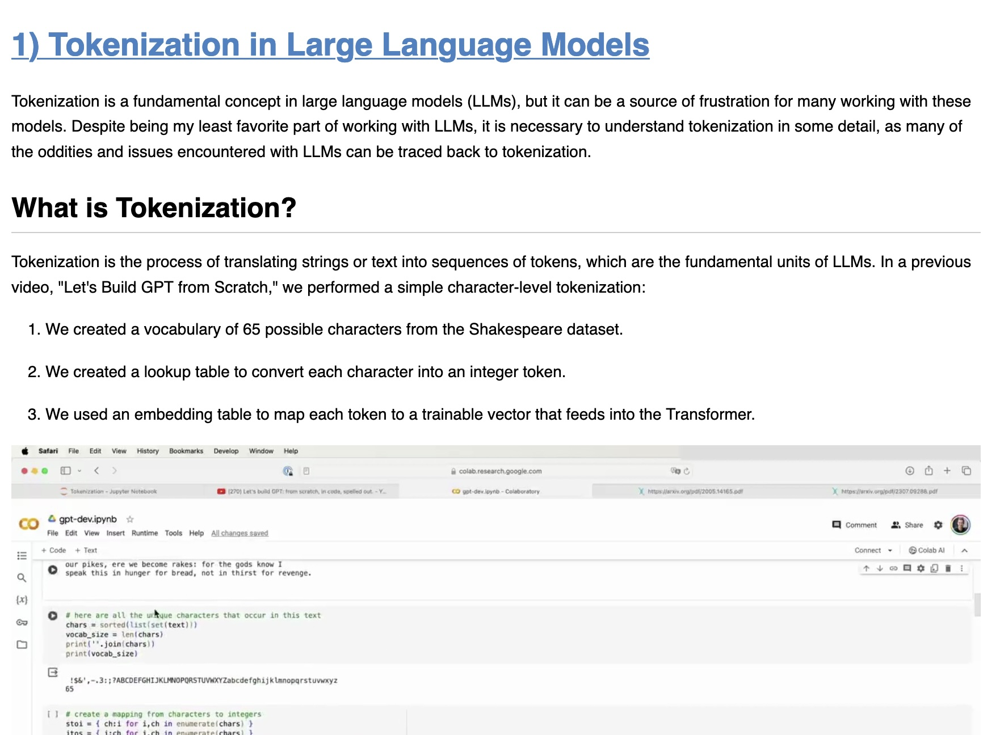

# Video2blogpost: Using Claude 3 Opus to transform a video tutorial in a blog post

This repository provides a baseline to reproduce [Anthropic's solution](https://twitter.com/mlpowered/status/1764718705991442622) to [Karpathy's challenge](https://twitter.com/karpathy/status/1760740503614836917) of converting a video tutorial in a blog post. 

See associated Medium article [here](https://medium.com/@ya-lb/using-claude-3-to-transform-a-video-tutorial-in-a-blog-post-d2c1e04e7a7b).

- Example video: [https://www.youtube.com/watch?v=zduSFxRajkE](https://www.youtube.com/watch?v=zduSFxRajkE)

- [Resulting blog post](https://yannael.github.io/video2blogpost/final_output/blogpost.html)

- Code is in the [main notebook](Video2BlogPost.ipynb).

