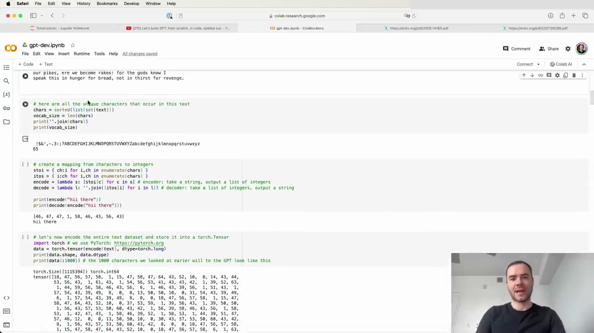
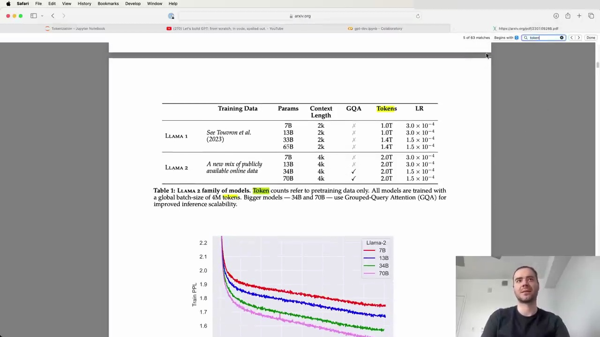

#  Tokenization in Large Language Models

Tokenization is a fundamental concept in large language models (LLMs), but it can be a source of frustration for many working with these models. Despite being my least favorite part of working with LLMs, it is necessary to understand tokenization in some detail, as many of the oddities and issues encountered with LLMs can be traced back to tokenization.

## What is Tokenization?

Tokenization is the process of translating strings or text into sequences of tokens, which are the fundamental units of LLMs. In a previous video, "Let's Build GPT from Scratch," we performed a simple character-level tokenization:

1. We created a vocabulary of 65 possible characters from the Shakespeare dataset.
2. We created a lookup table to convert each character into an integer token.
3. We used an embedding table to map each token to a trainable vector that feeds into the Transformer.

However, state-of-the-art language models use more complicated tokenization schemes, such as byte pair encoding (BPE), which operates on chunks of characters rather than individual characters.

## The Importance of Tokenization in LLMs

The GPT-2 paper introduced byte-level encoding as a tokenization mechanism for LLMs. They used a vocabulary of 50,257 possible tokens and a context size of 1,024 tokens, meaning each token attends to the previous 1,024 tokens in the attention layer of the Transformer.

Tokenization is pervasive in LLMs, as evidenced by the Llama 2 paper, which mentions "token" 63 times. They trained on two trillion tokens of data, highlighting the importance of tokenization in these models.

## Complexities and Issues Arising from Tokenization

Many issues encountered with LLMs can be traced back to tokenization, such as:

- Difficulty with spelling tasks
- Challenges in simple string processing
- Worse performance on non-English languages
- Issues with simple arithmetic
- Weird warnings about trailing whitespace
- Unrelated tangents in responses (e.g., "solid gold Magikarp")
- Recommendations to use YAML over JSON for structured data

In the next sections, we will dive deeper into the byte pair encoding algorithm and build our own tokenizer from scratch to gain a better understanding of this crucial component of large language models.

