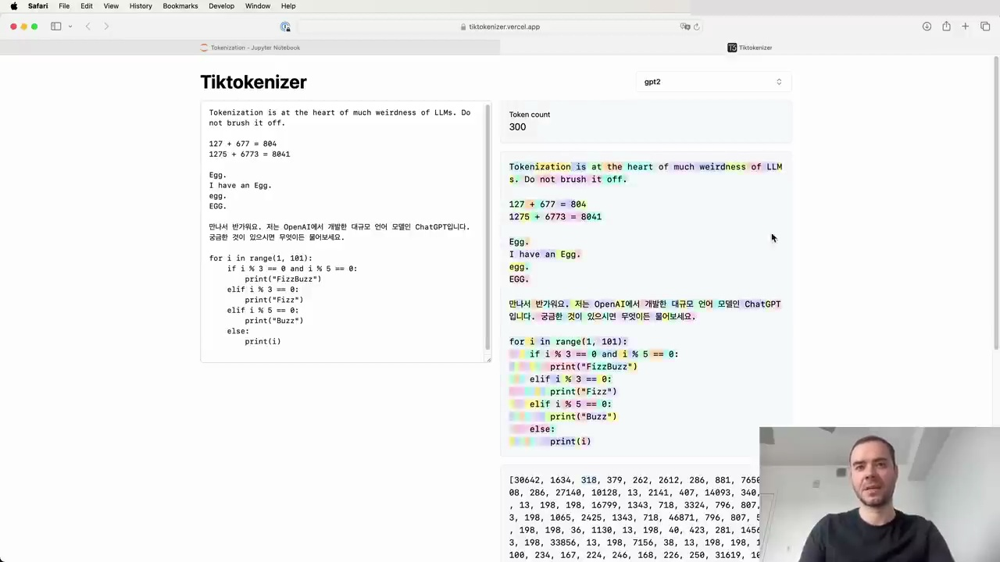
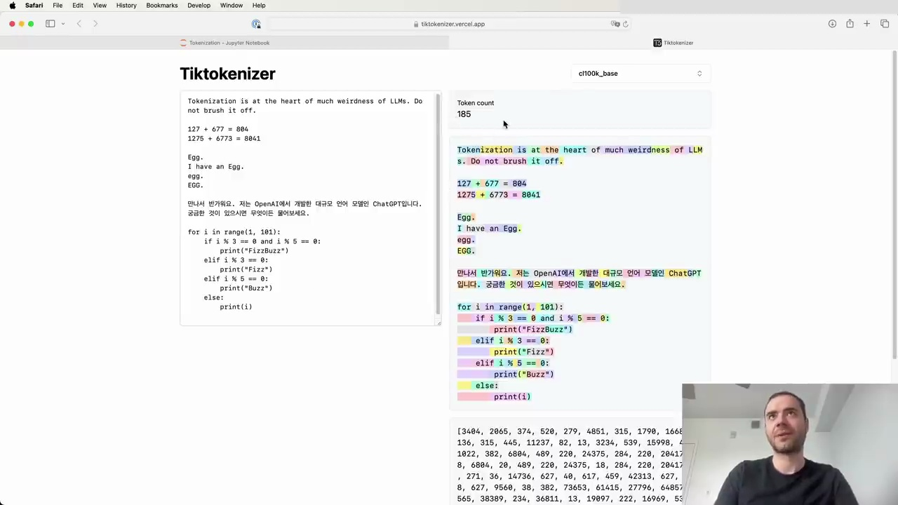
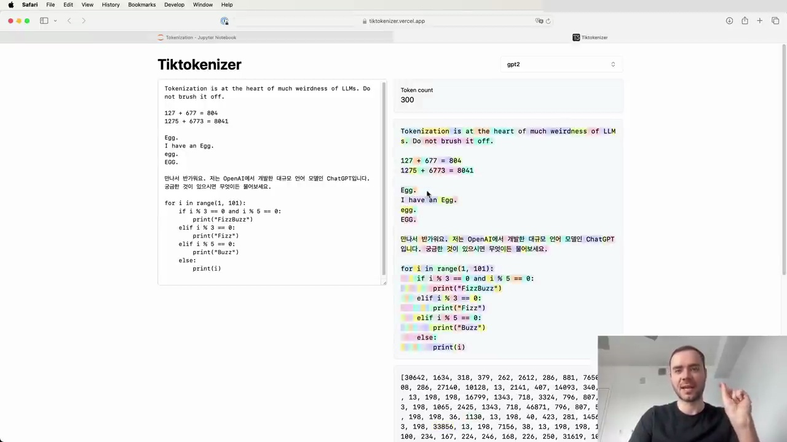
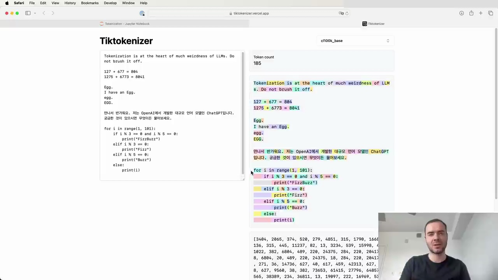

#  Tokenization in Large Language Models

Let's start with a simple example. If we input the string "hello world" into the Tik tokenizer using the GPT-2 tokenizer, we see that it breaks down into 300 tokens:

Each token is represented by a unique ID. For instance, the word "tokenization" becomes two tokens: 3,642 and 1,634. Spaces are also tokenized, with the token ID 318.

It's important to note that tokenization can be case-sensitive and context-dependent. For example, "egg" by itself is two tokens, but "a egg" is a single token.

## Tokenization in Non-English Languages

Non-English languages often have worse tokenization in LLMs due to the training data being skewed towards English. This results in longer token sequences for the same amount of information in non-English text.

As you can see, the Korean text here is broken up into many more tokens compared to an equivalent English sentence. This bloats the sequence length and can cause issues with the model running out of context.

## Tokenization in Programming Languages

Tokenization can also have a significant impact on how well LLMs handle programming languages. In the example below, we see how Python code is tokenized using the GPT-2 tokenizer:

Each individual space is a separate token (ID 220), which is extremely wasteful. This is one reason why GPT-2 struggles with Python code.

However, the GPT-4 tokenizer handles whitespace in Python much more efficiently:

Here, multiple spaces are grouped into a single token, making the input denser and allowing the model to attend to more code within its context window.

