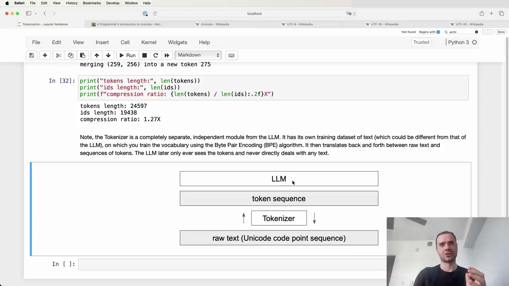
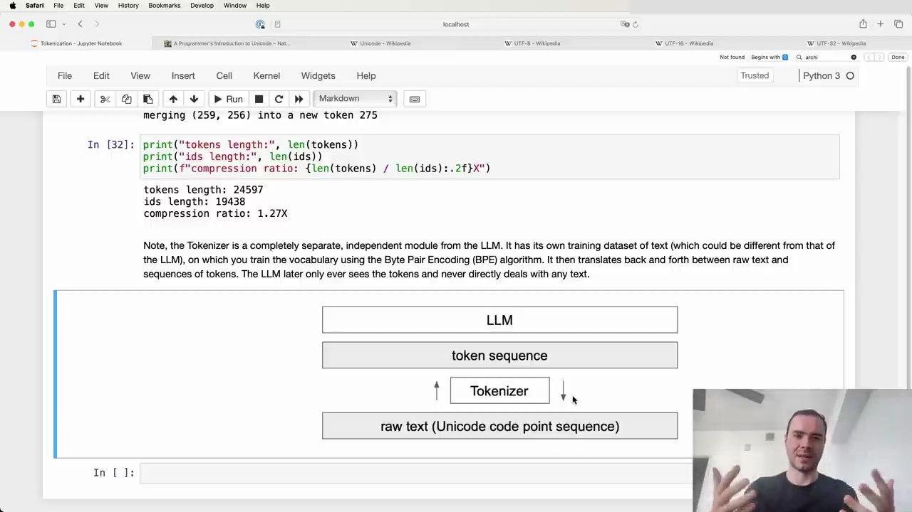

#  Tokenizers and Language Models

The Tokenizer is a completely separate, independent module from the Language Model (LLM). It has its own training dataset of text (which could be different from that of the LLM), on which you train the vocabulary using the Byte Pair Encoding (BPE) algorithm. It then translates back and forth between raw text and sequences of tokens. The LLM later only ever sees the tokens and never directly deals with any text.

## Encoding and Decoding with Tokenizers

Once the Tokenizer is trained and you have the vocabulary and merges, you can do both encoding and decoding:

- Encoding: Given raw text, the Tokenizer can turn it into a token sequence
- Decoding: Given a token sequence, the Tokenizer can translate it back into raw text

This allows translating between the realms of raw text (Unicode code point sequences) and token sequences that the LLM operates on.

## Tokenizer Training Considerations

When training the Tokenizer, you may want to consider using a training set with a mixture of different languages and code/non-code data. The amount of each type of data will determine how many merges there will be and the density of representation in token space.

For example, including a large amount of Japanese text in the Tokenizer training set will result in more Japanese tokens getting merged. This leads to shorter token sequences for Japanese, which is beneficial for the LLM that has a finite context length it can process in token space.

## Tokenization as a Preprocessing Step

A common approach is to take all the LLM training data and run it through the trained Tokenizer as a massive preprocessing step. This translates everything into token sequences which are stored on disk. The raw text can then be discarded, as the LLM only reads the tokens during its own training.

In summary, the Tokenizer is a crucial but completely separate component from the Language Model itself. With proper training that considers the target data mix, it enables efficient encoding of text into token sequences that LLMs can process.