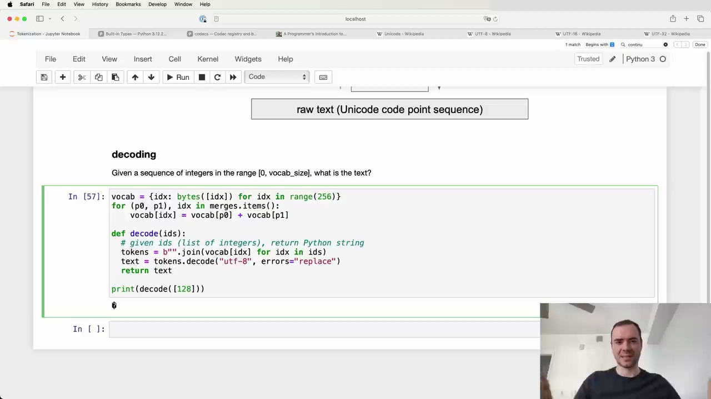
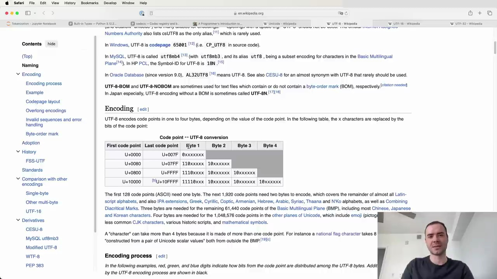

#  Decoding UTF-8 Tokens to Text

Given a sequence of integers in the range [0, vocab_size], we can decode them back into the original text using the following Python function:



```python
def decode(ids):
    # given ids (list of integers), return Python string
    tokens = b"".join(vocab[idx] for idx in ids)
    text = tokens.decode("utf-8", errors="replace")
    return text
```

The key steps are:

1. Create a `vocab` dictionary mapping token IDs to their byte representation.
2. Iterate over the input `ids` and look up the corresponding bytes in `vocab`.
3. Concatenate the bytes together into a single `tokens` byte string.
4. Decode the `tokens` byte string into a Python string using UTF-8 decoding.

## Handling Invalid UTF-8 Sequences

One tricky aspect is that not every possible byte sequence is a valid UTF-8 encoding. For example:



Trying to decode the single token ID 128 results in an error:

```
UnicodeDecodeError: 'utf-8' codec can't decode byte 0x80 in position 0: invalid start byte
```

This is because the binary representation of 128 (10000000) does not conform to the UTF-8 format, which requires multi-byte sequences to have a specific envelope structure.

To handle this, we can pass `errors="replace"` to the `str.decode()` method, which will replace invalid bytes with the Unicode replacement character (�). This is the standard practice used in code released by OpenAI and others.

By following this decoding process, we can convert the integer token sequence output by the language model back into human-readable text, with some tolerance for occasional invalid byte sequences.