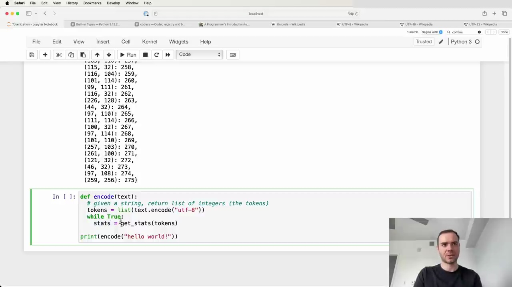
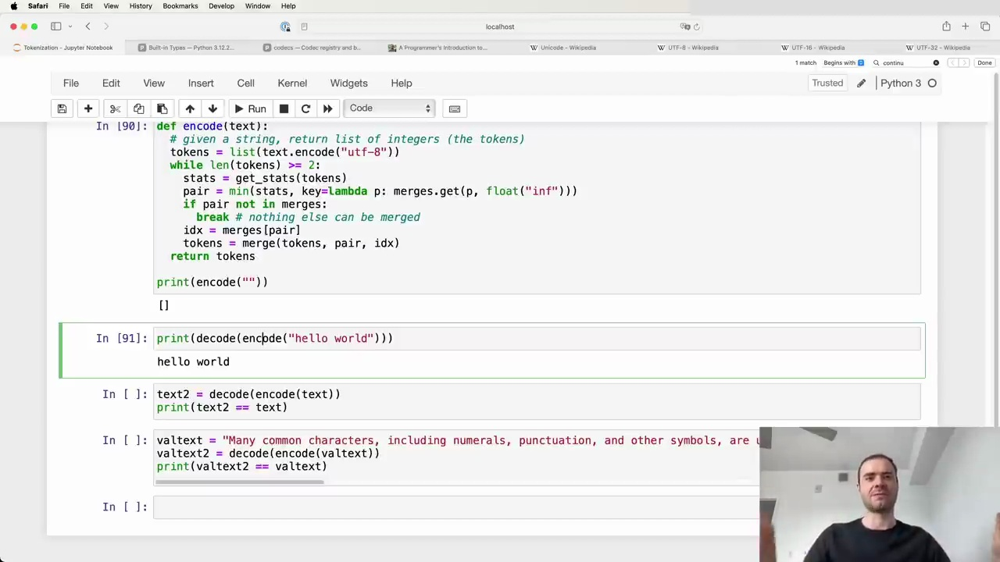
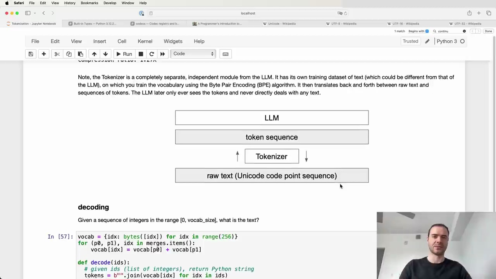

#  Byte Pair Encoding Algorithm

The Byte Pair Encoding (BPE) algorithm is used to train a tokenizer for language models. The process involves taking a training set, creating a dictionary of merges, and using this to encode and decode between raw text and token sequences.

## Training the Tokenizer

The parameters of the tokenizer are stored in a dictionary of merges, which creates a binary forest on top of raw bytes. The training process follows these steps:

1. Take the training text and encode it into UTF-8 bytes.
2. Convert the bytes into a list of integers.
3. Build a dictionary that counts the frequency of each consecutive pair of bytes.
4. Iteratively merge the most frequent pair and update the dictionary until a desired vocabulary size is reached.

## Encoding and Decoding

Once the merges table is created, it can be used to both encode and decode between raw text and token sequences.

To encode a string:

1. Encode the text into UTF-8 and convert to a list of integers.
2. Iteratively merge pairs of tokens according to the merges dictionary, starting with the earliest merges.
3. Return the final list of tokens.

To decode a sequence of tokens:

1. Iteratively split tokens according to the merges dictionary, starting with the latest merges.
2. Convert the resulting list of integers into bytes.
3. Decode the bytes using UTF-8 to get the original text.

It's important to note that while encoding and then decoding a string will result in the same string, the reverse is not always true. Not all token sequences are valid UTF-8 byte streams, so some may not be decodable.

## Complexities in Real-World Tokenizers

While the basic BPE algorithm is straightforward, the tokenizers used in state-of-the-art language models can be much more complex. The picture complexifies quickly, with various modifications and extensions to the basic algorithm.

Understanding these complexities is crucial for working with modern language models effectively. The details of these modifications will be explored further in subsequent sections.