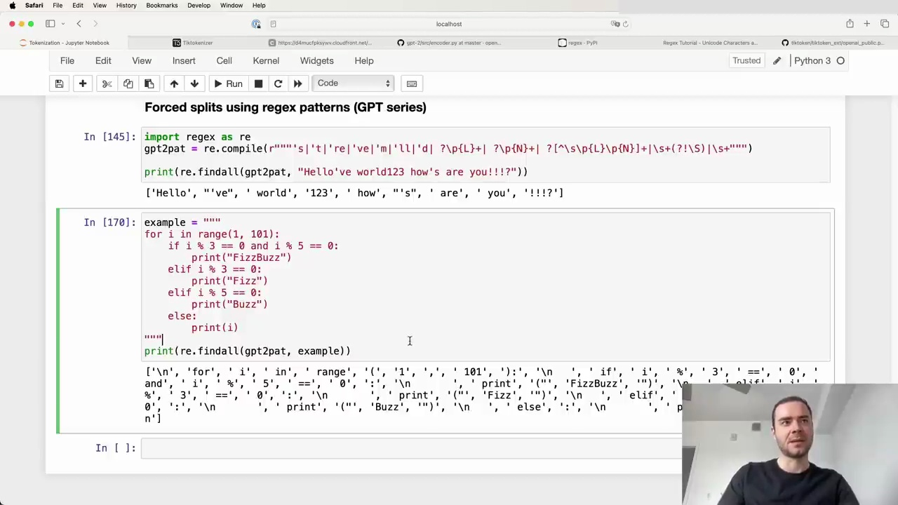
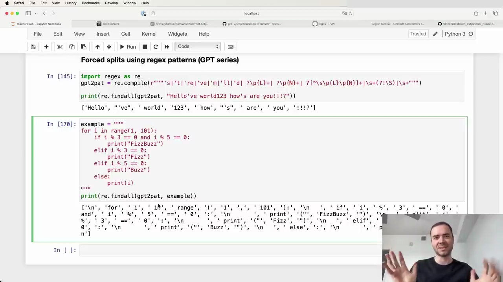
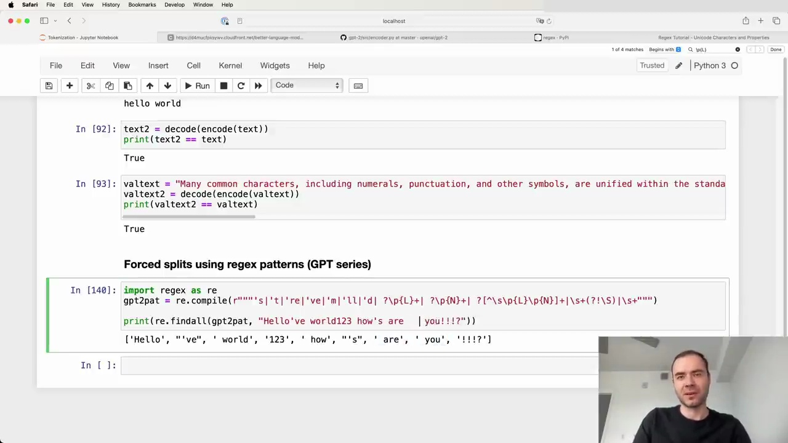

#  Tokenization in GPT-2

GPT-2 uses a modified version of the byte pair encoding (BPE) algorithm for tokenization. The paper discusses the input representation and how they enforce certain merging rules on top of the BPE algorithm to prevent suboptimal clustering of tokens.

## Enforcing Merging Rules

The GPT-2 tokenizer code uses a complex regex pattern to enforce rules for what parts of the text will never be merged:

This pattern splits the input text into chunks, and the BPE algorithm is applied independently within each chunk. The results are then concatenated to form the final tokenized sequence. This prevents merges across certain character types, such as letters, numbers, and punctuation.

## Analyzing the Regex Pattern

The regex pattern uses the `reex` package, an extension of Python's `re` module. It consists of several alternatives separated by `|` (OR) operators. The pattern matches the following, in order:

1. Apostrophe contractions (e.g., `'s`, `'t`)
2. Letters (`\p{L}`)
3. Numbers (`\p{N}`)
4. Non-letter, non-number, non-space characters (punctuation)
5. Whitespace up to but not including the last whitespace character

Here's an example of how the pattern splits a string:

The tokenizer separates letters, numbers, punctuation, and whitespace into different chunks, preventing merges across these categories.

## Inconsistencies and Limitations

The GPT-2 tokenizer has some inconsistencies and limitations:

- It is hardcoded for specific apostrophe types and may not handle Unicode apostrophes correctly.
- The apostrophe handling is case-sensitive, leading to inconsistent tokenization for uppercase and lowercase contractions.
- The apostrophe rules are language-specific and may not work well for all languages.

## Training the Tokenizer

The exact training process for the GPT-2 tokenizer is not fully known, as the training code was never released. The available code is only for inference, applying pre-trained merges to new text. It is evident that OpenAI enforced additional rules beyond chunking and BPE, such as never merging whitespace characters.

In conclusion, the GPT-2 tokenizer uses a modified BPE algorithm with additional rules to prevent suboptimal merging of tokens. While it has some limitations and inconsistencies, it aims to improve the tokenization process for the language model.