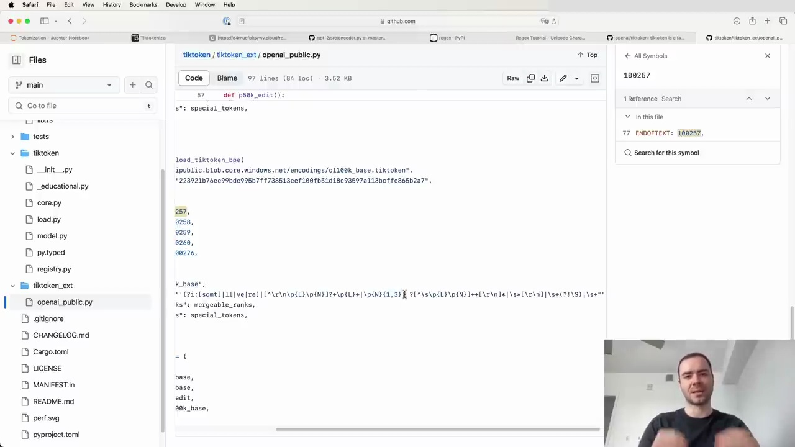
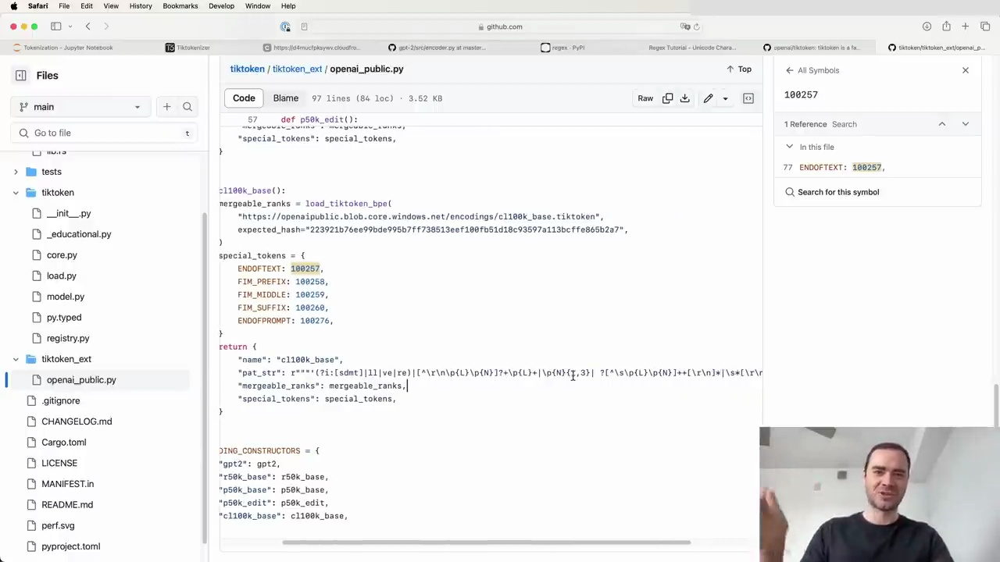

#  Tokenization with Tiktoken

OpenAI provides an official library for tokenization called Tiktoken. To use it, first install the package:

```
pip install tiktoken
```

Tiktoken can be used for tokenization during inference (not training). Here's a simple example of using Tiktoken to compare the tokenization of GPT-2 vs GPT-4:



Running this code will output the tokens for both the GPT-2 and GPT-4 tokenizers. A key difference is that whitespace remains unmerged in GPT-2 tokens, while it becomes merged in GPT-4 tokens.

## Changes in GPT-4 Tokenizer

The GPT-4 tokenizer, referred to as `cl100k_base`, has some notable changes compared to the GPT-2 tokenizer. These changes can be found in the `tiktoken/tiktoken_ext/openai_public.py` file, which contains the definitions for the various tokenizers maintained by OpenAI.



Some of the major changes in the GPT-4 tokenizer include:

1. Case-insensitive matching for apostrophes (e.g., `'s`, `'d`, `'m`).
2. Different handling of whitespace (details not specified).
3. Numbers are only merged when they are 1-3 digits long, preventing very long number sequences from being merged.

The vocabulary size has also increased from roughly 50k in GPT-2 to around 100k in GPT-4.

It's important to note that the reasoning behind these changes is not documented, and the information provided is based on the patterns observed in the tokenizer definitions.