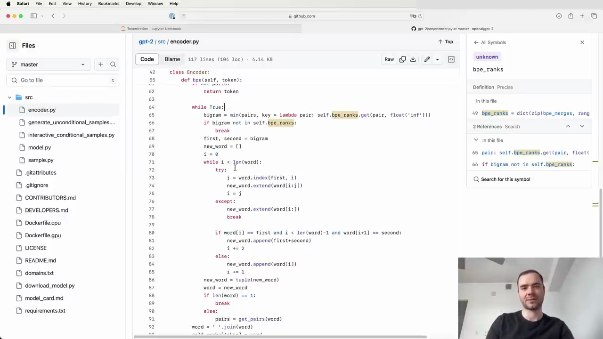

#  GPT-2 Encoder Implementation

OpenAI has released the `encoder.py` file as part of their GPT-2 model. This file contains the implementation of the tokenizer used in GPT-2. Let's take a closer look at how it works.

## Tokenizer Components

The GPT-2 tokenizer consists of two main components:

1. **Encoder**: This is equivalent to our `vocab` object, which allows efficient decoding by mapping integers to bytes.

2. **Vocab BPE**: Despite the confusing name, this is actually equivalent to our `merges` variable. It contains the byte pair encoding (BPE) merges based on the data inside `vocab.bpe`.

## Encoding and Decoding Process

The encoding and decoding process in the GPT-2 tokenizer involves the following steps:

1. Byte Encoding: The input is first passed through a byte encoder.
2. Encoding: The byte-encoded input is then encoded using the tokenizer.
3. Decoding: The encoded tokens are decoded using the tokenizer.
4. Byte Decoding: The decoded output is finally passed through a byte decoder.

It's worth noting that the byte encoder and byte decoder are not particularly interesting or deep implementation details. They are simply stacked serially on top of the tokenizer.

## BPE Function

The core of the `encoder.py` file lies in the `bpe` function. This function is similar to our own implementation, where it identifies the next bigram pair to merge. It iterates over the sequence and merges the pair whenever it is found. This process is repeated until no more merges are possible in the text.

## Encode and Decode Functions

The `encoder.py` file also includes `encode` and `decode` functions, just like we have implemented. These functions handle the encoding and decoding of the input using the tokenizer.

## Conclusion

While the code in `encoder.py` may appear a bit messy, it is algorithmically identical to what we have built. Understanding our own implementation provides a solid foundation for comprehending the GPT-2 tokenizer. The key takeaway is that the tokenizer consists of the `vocab` and `merges` variables, which are used for encoding and decoding the input.