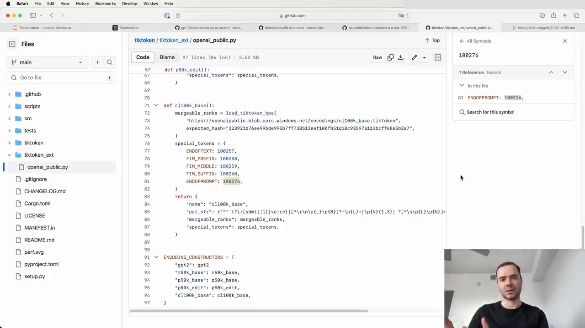

#  Special Tokens in Tokenization

When tokenizing text, in addition to tokens derived from raw bytes and byte pair encoding (BPE) merges, special tokens can be inserted to delimit different parts of the data or create a special structure in the token stream.

## OpenAI's GPT-2 Tokenizer

The `encoder` object from OpenAI's GPT-2 tokenizer has a length of 50,257. This number comes from:
- 256 raw byte tokens
- 50,000 BPE merge tokens
- 1 special token: "end of text" (token ID 50256)

The "end of text" token is used to delimit documents in the training set. It signals to the language model that the document has ended and what follows is unrelated to the previous document. The model learns from the data that this token indicates it should reset its memory of the preceding context.

## Extending the Tokenizer

The `tiktoken` library allows extending the tokenizer by adding more special tokens. These tokens can be used to delimit conversations between an assistant and a user in fine-tuned models like GPT-3.5 Turbo.

To extend the tokenizer:
1. Fork the base tokenizer (e.g., cl100k_base for GPT-4)
2. Add arbitrary special tokens with new IDs
3. The `tiktoken` library will swap them out when encountered in strings

## Model Surgery for Special Tokens

When adding special tokens, the language model's architecture needs to be adjusted:
- Extend the embedding matrix by adding a row for each new token, initialized with small random numbers
- Extend the final layer's projection (classifier) by the number of added tokens

This model surgery is a common operation when fine-tuning a base model into a chat model like ChatGPT.

By leveraging special tokens, language models can be adapted to handle structured conversations and delimit various parts of the input data, enabling more advanced applications beyond simple next-token prediction.