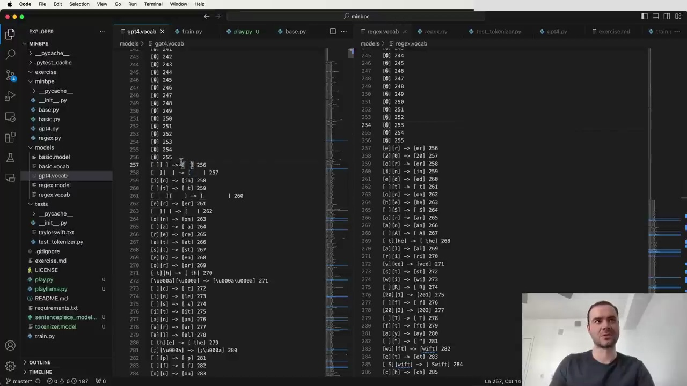

#  Building a GPT-4 Tokenizer

The process of developing a GPT-4 tokenizer can be broken down into four steps. The code for this exercise is available in the MBP repository on GitHub. The repository includes tests and clean, understandable code to reference if you get stuck.

Once you have written your tokenizer, you should be able to reproduce the behavior of the `tiktoken` library:

- Encode a string and get the corresponding tokens
- Encode and decode a string to recover the original text
- Implement your own `train` function to train token vocabularies (not provided by `tiktoken`)

## Comparing Token Vocabularies

The MBP repository shows examples of the token vocabularies you might obtain when training your own tokenizer. The first 256 tokens are raw individual bytes. The remaining tokens represent the merges performed by the tokenizer during training, in the order they occurred.

For example, the first merge GPT-4 performed was combining two spaces into a single token (token 256). Similarly, in the MBP tokenizer trained on a Wikipedia page about Taylor Swift, the merge of "space t" into "space t" happened a bit later.

The differences in the merge order are due to the different training sets used. GPT-4 likely had a lot of Python code in its training set, based on the prevalence of whitespace tokens. In contrast, the Wikipedia-trained tokenizer shows fewer whitespace-related merges.

Despite the differences, the resulting vocabularies look similar because they are generated using the same algorithm. When you train your own tokenizer, you can expect to see comparable results, with variations depending on your training data.

## Next Steps

With this knowledge, you now have everything you need to build your own GPT-4 tokenizer. Follow the exercise progression in the MBP repository, referencing the provided code and tests whenever you need guidance. Happy coding!