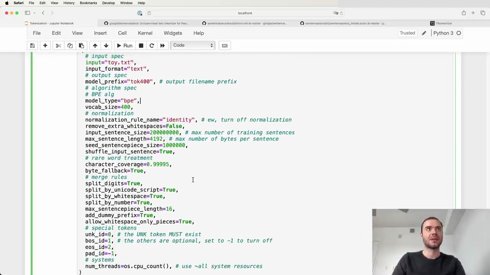
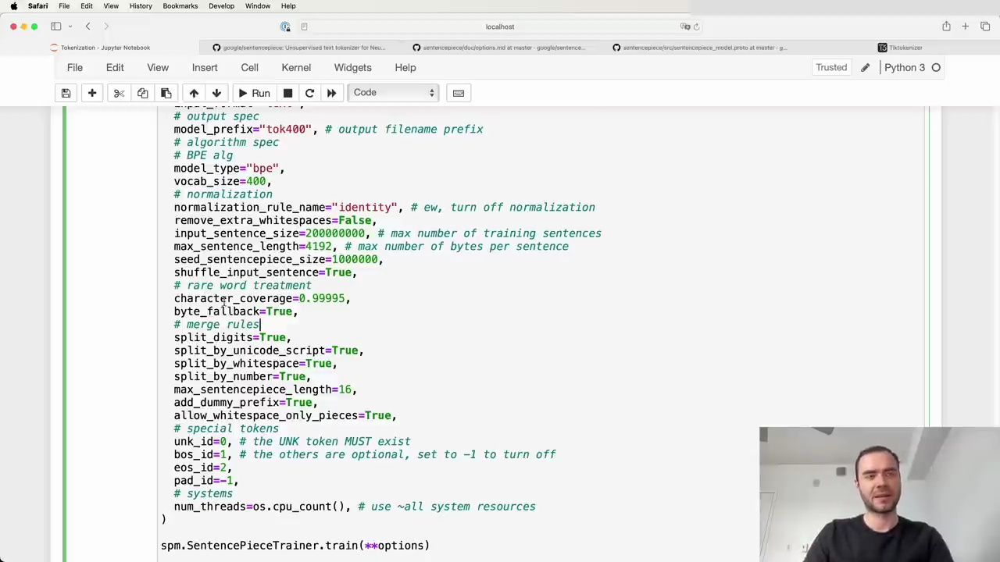
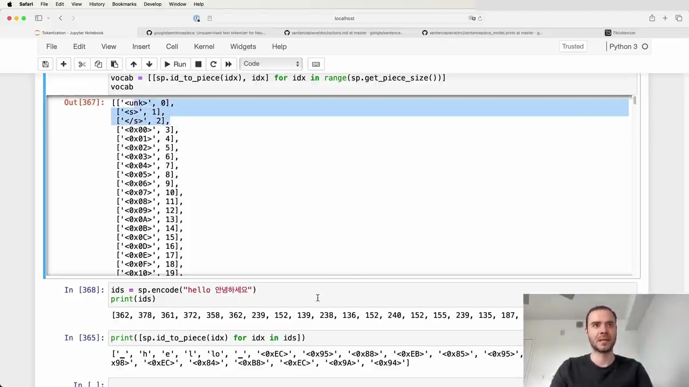

#  Exploring Sentence Piece Tokenization for Language Models

Sentence Piece is a commonly used library for tokenization in language models, supporting both training and inference. It is used by models like Llama and Mistal series. Let's explore how Sentence Piece differs from Tik Token in its approach to tokenization.

## Sentence Piece vs Tik Token

The key difference between Sentence Piece and Tik Token is in the order of operations:

- Tik Token first takes the code points in the string, encodes them using mutf to bytes, and then merges bytes. 
- Sentence Piece works directly at the level of code points. It looks at the code points available in the training set and starts merging those code points.

Sentence Piece runs byte pair encoding (BPE) on the code points. For rare code points that don't appear often (determined by the `character_coverage` hyperparameter), it either maps them to a special unknown token like `<unk>`, or if `byte_fallback` is turned on, it encodes those rare code points using UTF-8 and translates the individual bytes into special byte tokens added to the vocabulary.

## Training a Sentence Piece Model

To train a Sentence Piece model, you provide a text file and specify various options:

Some key options used in the Llama 2 tokenizer:

- `input`: path to the raw text file 
- `model_prefix`: output filename prefix
- `model_type`: algorithm (e.g. `BPE`)
- `vocab_size`: desired vocabulary size
- normalization and pre-processing rules
- `split_by_whitespace`, `split_by_number`, etc.: rules for splitting digits, whitespace, numbers
- special tokens: `unk_id`, `bos_id`, etc.
- `byte_fallback`: whether to fall back to byte encoding for rare code points
- `add_dummy_prefix`: adds a space prefix to treat words consistently

After training, the model and vocab files are generated. The vocab starts with special tokens, then byte tokens (if `byte_fallback` is true), then merge tokens, and finally individual code point tokens.

## Encoding and Decoding

With a trained model, you can encode text into token IDs and decode IDs back into tokens:

If `byte_fallback` is false and the input contains unseen code points, they get mapped to the `<unk>` token (ID 0). With `byte_fallback` true, rare code points are encoded into byte tokens.

The `add_dummy_prefix` option helps treat words consistently by adding a space prefix. For example, "world" by itself would have a different token than "world" preceded by a space, so this option ensures they map to the same token.

## Summary

While powerful, Sentence Piece has some historical baggage and concepts that can be confusing, like the notion of "sentences". Its documentation could also be improved. However, it remains a commonly used library for efficient tokenization in language models. By understanding its key options and behavior, you can train tokenizers that match those used in models like Llama 2.