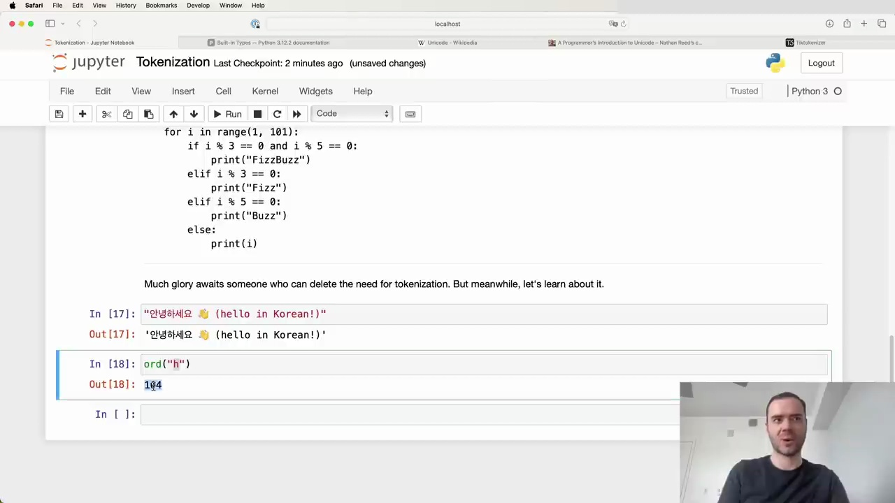
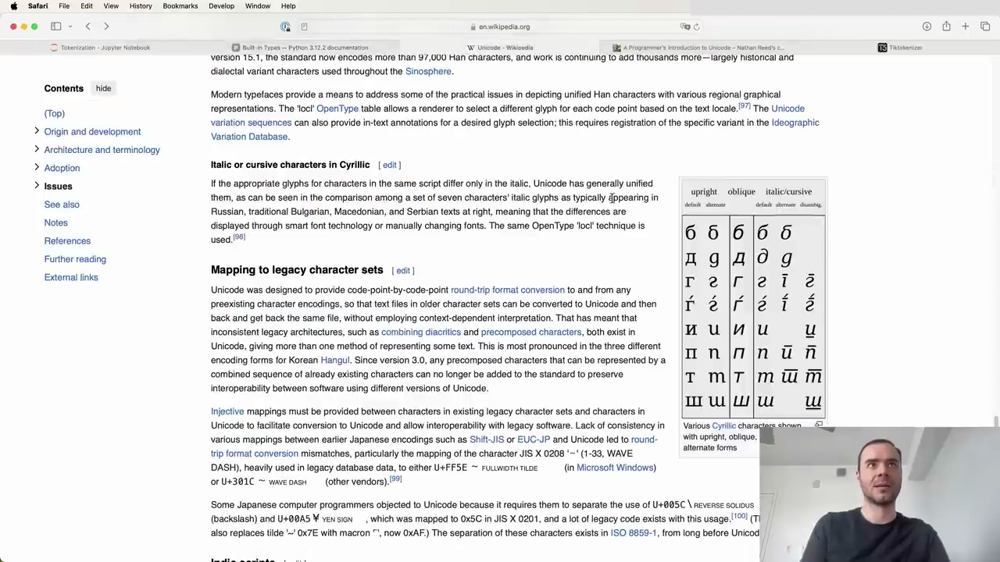

#  Tokenization: Encoding Text for Language Models

Language models require text to be tokenized into integers that map to a fixed vocabulary. This process is more complex than simply using the Unicode standard, as it needs to support various languages, special characters, and emojis found on the internet. Let's explore how to properly tokenize text for use in Transformers.

## Unicode and Code Points

Strings in Python are immutable sequences of Unicode code points. The Unicode Consortium defines roughly 150,000 characters across 161 scripts in the Unicode standard. Each character is assigned a unique integer code point.

We can access the Unicode code point of a single character using Python's `ord()` function:

For example, `ord("H")` returns `104`, while more complex characters like emojis have much higher code points, such as `128514` for 😂.

However, directly using Unicode code points for tokenization has some drawbacks:

1. The vocabulary would be quite large, around 150,000 different code points.
2. The Unicode standard is constantly evolving, making it an unstable representation.

Therefore, we need a better tokenization method for language models.

## Tokenization for Language Models

A more suitable approach is to use a tokenizer specifically designed for language models. These tokenizers aim to provide a stable, efficient representation of text that can handle various languages and character sets.

Some key aspects of tokenization for language models include:

- Mapping to legacy character sets for interoperability with existing software
- Providing inclusive mappings between characters in legacy sets and Unicode
- Handling inconsistent legacy architectures and precomposed characters
- Supporting a wide range of encoding forms for Korean Hangul

By using a well-designed tokenizer, we can convert text into a sequence of integers that can be fed into the Transformer model as input. This allows the model to process and understand a wide variety of text, including different languages and special characters.

In summary, tokenization is a crucial step in preparing text for use in language models. While the Unicode standard provides a foundation, specialized tokenizers are needed to create a stable and efficient representation suitable for Transformers and other NLP tasks.