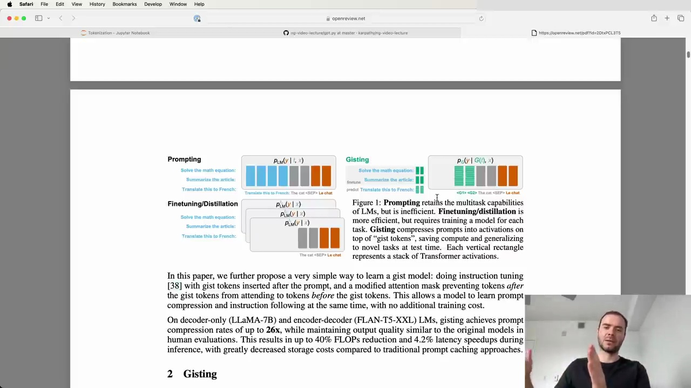

#  Compressing Prompts with Gist Tokens

Figure 1: Prompting retains the multitask capabilities of LMs, but is inefficient. Finetuning/distillation is more efficient, but requires training a model for each task. Gisting compresses prompts into activations on top of "gist tokens", saving compute and generating time to novel tasks at test time. Each vertical rectangle represents a stack of Transformer activations.

In this paper, we further propose a very simple way to learn a gist model: doing instruction tuning [38] with gist tokens inserted after the prompt, and a modified attention mask preventing tokens after the gist tokens from attending to tokens before the gist tokens. This allows a model to learn prompt compression and instruction following at the same time, with no additional training cost.

On decoder-only (LLaMA-7B) and encoder-decoder (FLAN-T5-XXL) LMs, gisting achieves prompt compression rates of up to 26x, while maintaining output quality similar to the original models. In human evaluations, this results in up to 40% FLOPs reduction and 4.2% latency speedups during inference, with greatly decreased storage costs compared to traditional prompt caching approaches.

## Gisting

Gisting compresses prompts into activations on top of "gist tokens", saving compute and generating time to novel tasks at test time. This allows a model to learn prompt compression and instruction following at the same time, with no additional training cost.

The key ideas are:

1. Introduce new "gist tokens" into the vocabulary
2. Train the model by distillation, keeping the entire model frozen except the embeddings of the new gist tokens
3. Optimize the gist token embeddings such that the behavior of the language model with the gist tokens is identical to using the original long prompt
4. At test time, discard the original prompt and just use the gist tokens, which stand in for the long prompt with almost identical performance

This parameter-efficient fine-tuning technique fixes most of the model weights, only training the token embeddings. It provides a way to compress very long prompts into a few tokens, improving efficiency while maintaining task performance.