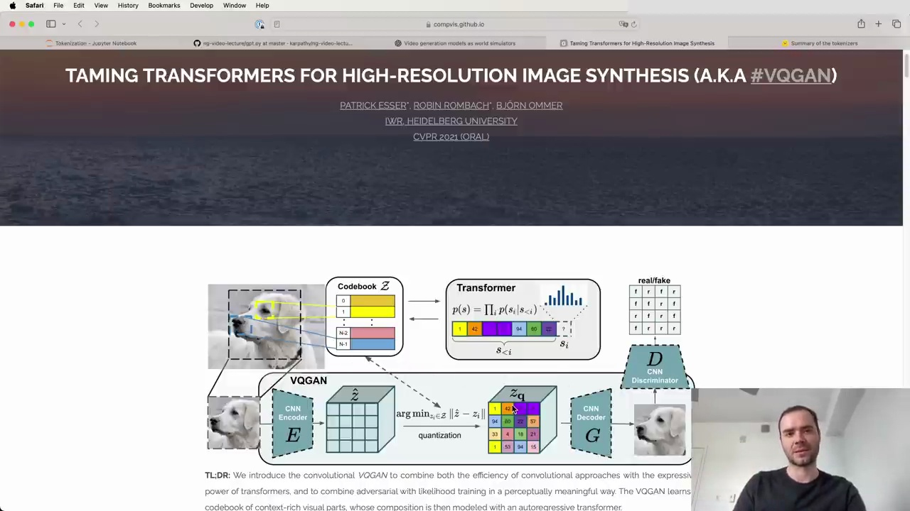

#  Combining Efficiency of Convolutional Approaches with Expressiveness of Transformers for High-Resolution Image Synthesis

Recently, there has been a lot of momentum in constructing Transformers that can simultaneously process not just text as the input modality, but also images, videos, audio, and other modalities. The key question is how to feed in all these modalities and potentially predict them from a Transformer without fundamentally changing the architecture.

Many are converging towards sticking with the Transformer architecture and tokenizing the input domains, treating them like text tokens. For example, an early paper demonstrated taking an image and chunking it into integer tokens. These tokens can be hard tokens forced to be integers, or soft tokens that don't require discrete representations but are forced through bottlenecks like in autoencoders.

A recent paper from OpenAI, SORA, inspired many by showing what's possible in this area. They process discrete tokens with autoregressive models and soft tokens with diffusion models. The details are beyond the scope here, but it's an active area of research and design.

The key takeaway is that by introducing computational VQGAN to combine the efficiency of convolutional approaches with the expressiveness of Transformers and likelihood training, it enables a perceptually meaningful way to compress transformers and combine both the efficiency of convolutional approaches with the expressiveness of Transformers.