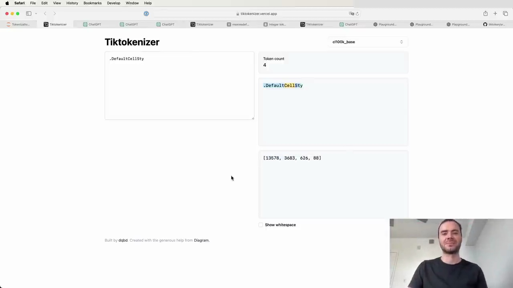
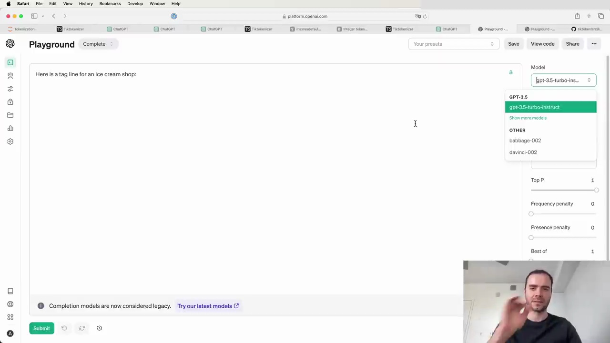

#  Tokenization in Large Language Models

Large language models (LLMs) rely on tokenization to process and understand text. However, the tokenization process can lead to some interesting and sometimes unexpected behaviors. Let's explore some of these quirks and their implications.

## Why LLMs Struggle with Spelling and Character-Level Tasks

LLMs often struggle with spelling and character-level tasks due to the way tokens are created. Some tokens can contain many characters, like "DefaultCellStyle," which is a single token in the GPT-4 vocabulary. When asked to count the number of "L" characters or reverse the string, the model struggles because it treats the entire token as a single unit.

However, if the characters are separated by spaces, the model can process them individually and perform the requested task more accurately.

## Tokenization and Non-English Languages

LLMs perform worse on non-English languages partly due to the tokenization process. Non-English words and phrases often require more tokens to represent, leading to a "blowup" in token count. For example, "hello how are you" is five tokens, while its Korean translation is 15 tokens. This makes the representation more diffuse and can impact the model's performance.

## Tokenization and Simple Arithmetic

LLMs struggle with simple arithmetic due to the arbitrary tokenization of numbers. The way digits are merged or split into tokens is inconsistent, making it difficult for the model to perform character-level arithmetic operations. Some models, like Llama 2, address this issue by explicitly splitting digits during tokenization to improve arithmetic performance.

## Tokenization and Python Code

GPT-2 performs poorly on Python code due to inefficient tokenization of spaces. In GPT-2, every space is treated as an individual token, dramatically reducing the context length the model can attend to. This issue was later fixed in GPT-4.

## The Trailing Whitespace Issue

Adding a trailing space to a prompt can cause worse performance due to how the API splits text into tokens. The space becomes a separate token, which is rare in the training data and can lead to unexpected completions.

## The Curious Case of "SolidGoldMagikarp"

"SolidGoldMagikarp" is a Reddit user whose username became a single token in the GPT-2 vocabulary due to its frequent occurrence in the tokenization dataset. However, this token never appeared in the actual language model training data, leading to undefined behavior when the token is evoked at test time.

## Token Efficiency and Data Formats

Different data formats have varying token efficiencies. For example, YAML is more token-efficient than JSON. In a token-based economy, where costs are associated with the number of tokens processed, it's essential to consider the tokenization density of different formats and settings to optimize performance and cost.

Understanding the intricacies of tokenization is crucial for working effectively with LLMs. By being aware of these quirks and their implications, we can better navigate the challenges and opportunities presented by these powerful models.