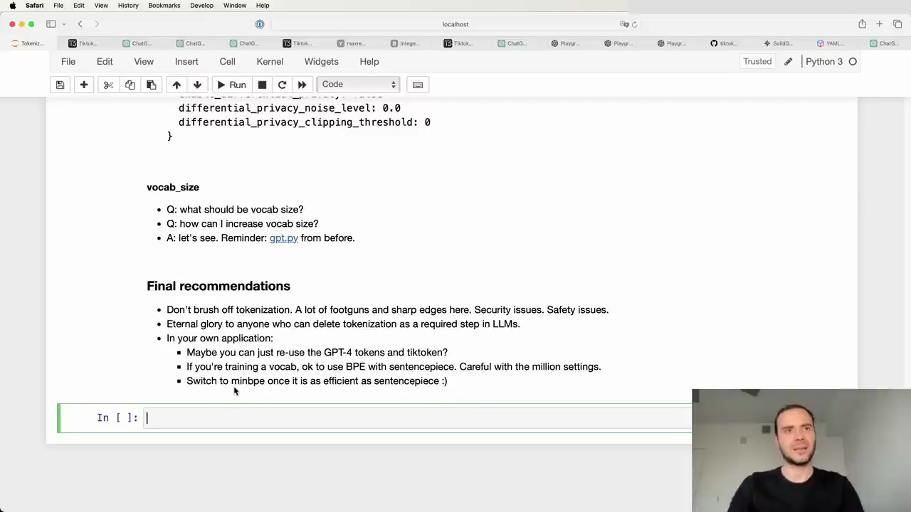

#  Tokenization Recommendations and Considerations

Don't brush off tokenization. There are a lot of footguns, sharp edges, security issues, and AI safety issues here. It's worth understanding this stage.

## Reusing GPT-4 Tokens and Vocabulary

If you can reuse the GPT-4 tokens and vocabulary in your application, consider using Tiktoken. It is a very efficient and nice library for inference with BPE.

## Byte-Level BPE

The byte-level BPE that Tiktoken and OpenAI use is also recommended if you need to train your own vocabulary from scratch.

## Sentence Piece Considerations

Be very careful with the settings when using Sentence Piece. It's easy to miscalibrate the hyperparameters and end up cropping sentences incorrectly. 

Some issues with Sentence Piece:

- Its byte fallback is not ideal
- It does BPE on Unicode code points, which is inferior to other approaches
- It has many settings that are easy to misconfigure

If using Sentence Piece, copy settings exactly from what others like Meta have done. Spend time understanding all the hyperparameters and go through the Sentence Piece code to ensure correctness.

## Ideal Future Solution

Ideally, we want something like Tiktoken but with training code included. This would provide the best of both worlds - the efficiency of Tiktoken for inference with the ability to train custom vocabularies.

MBPE is an implementation moving in this direction, but it is currently in Python. Work is needed to make MBPE as efficient as possible for an ideal tokenization solution in the future.