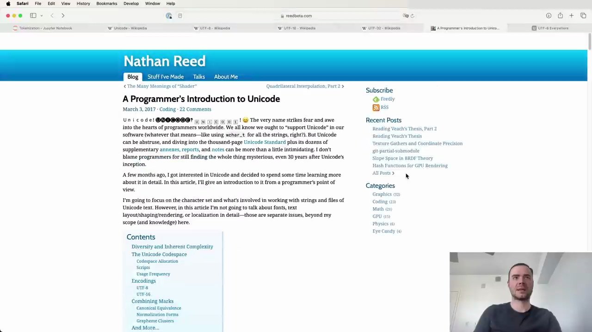
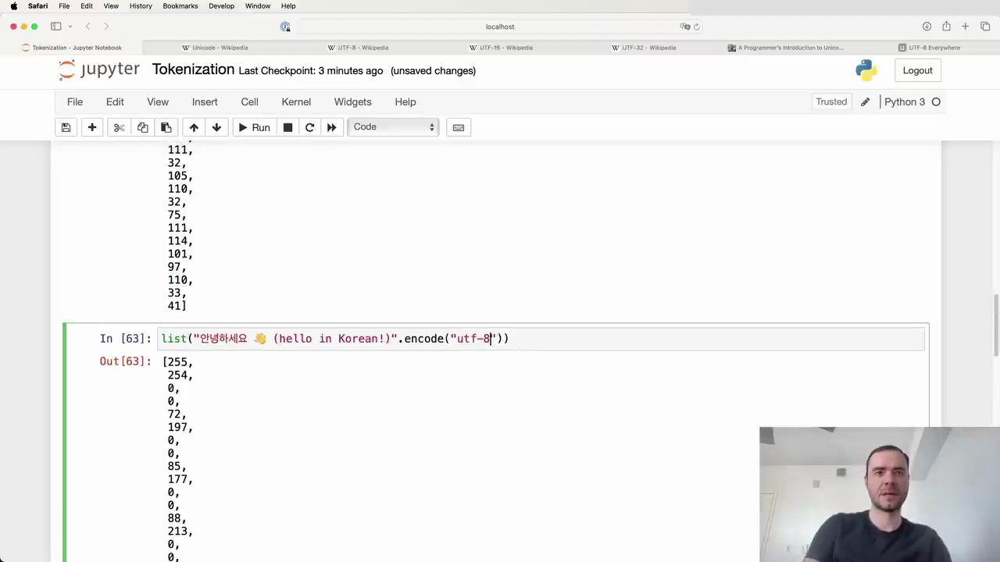
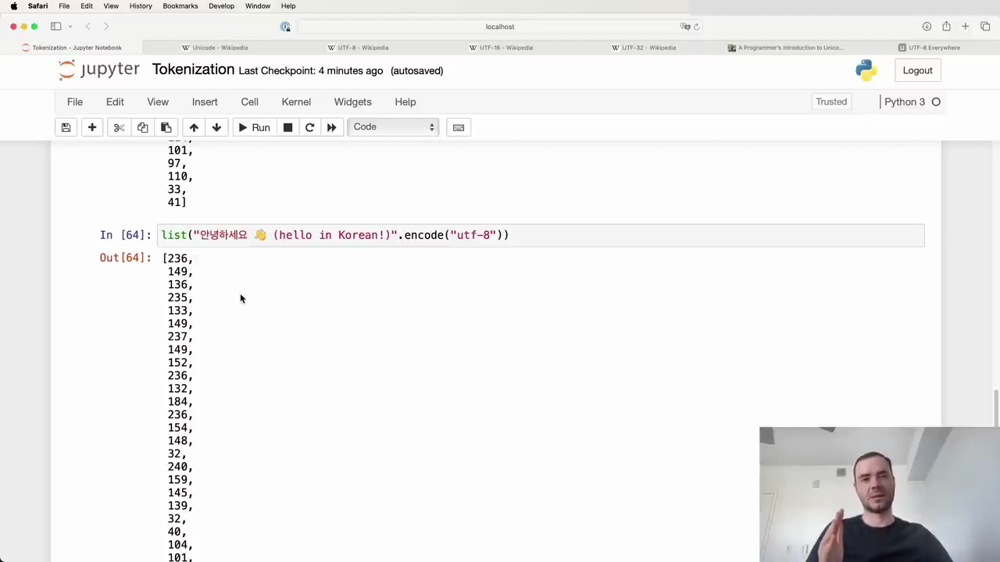

#  A Programmer's Introduction to Unicode

Unicode is a very important concept for programmers worldwide. We all know we ought to "support Unicode" in our software (whatever that means—like using wchar_t for all the strings, right?). But Unicode can be abstruse, and diving into the thousand-page Unicode Standard plus its dozens of supplementary annexes, reports, and notes can be more than a little intimidating. I don't blame programmers for still finding the whole thing mysterious, even 30 years after Unicode's inception.

A few months ago, I got interested in Unicode and decided to spend some time learning more about it in detail. In this article, I'll give an introduction to it from a programmer's point of view.

I'm going to focus on the character set and what's involved in working with string and files of Unicode text. However, in this article I'm not going to talk about fonts, text layout/shaping/rendering, or localization in detail—those are separate issues, beyond my scope (and knowledge) here.

## Contents

- Diversity and Inherent Complexity
- The Unicode Codespace
- Codespace Allocation
- Scripts
- Usage Frequency
- Encodings
- UTF-8
- UTF-16
- Combining Marks
- Canonical Equivalence
- Normalization Forms
- Grapheme Clusters
- And More...

## UTF-8 Encoding

UTF-8 is by far the most common Unicode encoding. This Wikipedia page is quite long, but what's important for our purposes is that UTF-8 takes every single code point and translates it to a byte stream between 1 to 4 bytes. It's a variable length encoding, so depending on the Unicode code point, you'll end up with between 1 to 4 bytes for each code point.

Let's try encoding a string to UTF-8 in Python:

The string class has an `encode()` method where you can specify the encoding like "utf-8". This returns a bytes object, which isn't very nicely printed. I personally like to pass it through `list()` to see the raw bytes of the encoding.

We can compare this to UTF-16 and UTF-32 encodings:

With UTF-16 and UTF-32, we start to see some of their disadvantages. There are a lot of zero bytes, especially for simple ASCII/English characters. It's a bit wasteful.

## Byte Pair Encoding

If we just used the raw UTF-8 bytes naively, that would imply a vocabulary size of only 256 possible tokens. This is very small, and would result in our text being stretched out over very long sequences of bytes.

While the embedding table and final prediction layer would be tiny, our sequences would become very long. We have pretty finite context length and attention that we can support in a transformer for computational reasons. So we only have so much context length to work with, but now have very long sequences. It's inefficient and won't allow us to attend to sufficiently long text.

We don't want to use the raw UTF-8 bytes. We want to support a larger vocabulary size that we can tune as a hyperparameter, while still sticking with the UTF-8 encoding.

The solution is to use the byte pair encoding (BPE) algorithm. This will allow us to compress these byte sequences to a variable amount.

BPE enables us to tune the vocabulary size as a hyperparameter and compress the UTF-8 byte streams accordingly. We'll get more into the details of how BPE works in a bit. But this provides a nice balance - sticking with UTF-8 encoding while having control over the vocab size.

In summary:
- Unicode is a complex but important topic for programmers to understand 
- UTF-8 is the most common and preferred Unicode encoding
- Using raw UTF-8 bytes leads to very long sequences and tiny vocab sizes
- Byte pair encoding allows compressing UTF-8 streams while tuning the vocabulary size

Next up, we'll dive deeper into exactly how the BPE algorithm works to achieve this. Stay tuned!