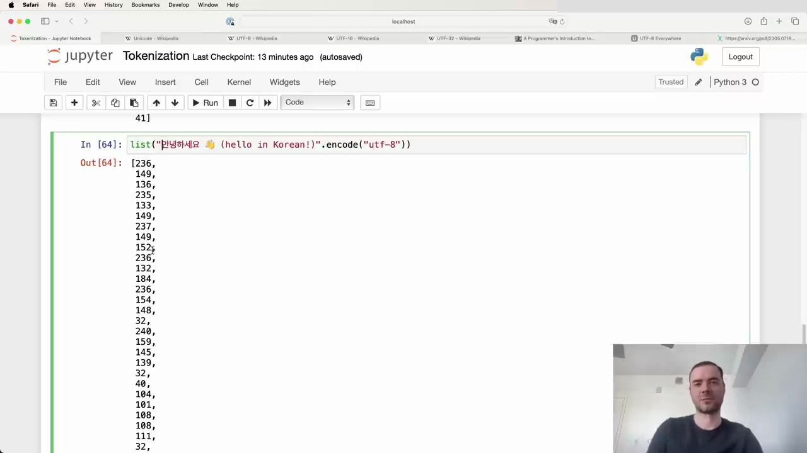

#  Tokenization-Free Language Modeling

Feeding raw byte sequences into language models is an attractive idea, but it comes with some hurdles:

- Attention becomes extremely expensive due to the long sequences
- Modifications to the Transformer architecture are required

A paper from last summer proposed a hierarchical structuring of the Transformer to enable feeding in raw bytes. The authors state:

> "Together these results establish the viability of tokenization-free autoregressive sequence modeling at scale."

However, this approach has not yet been widely proven at sufficient scale by many research groups.

## The Need for Tokenization

Given the current limitations, we still need to compress the input using tokenization algorithms like Byte Pair Encoding (BPE) before feeding it into language models. Here's an example of how the BPE algorithm works in Python:

The code demonstrates the `list()` function being called with a string argument `"안녕하세요 (hello in Korean)"` and the `encode("utf-8")` method to convert it into a byte sequence.

## Looking Ahead

Tokenization-free language modeling holds great promise for simplifying and streamlining the input process. If successful, we could feed byte streams directly into our models without the need for tokenization steps.

While more research and validation are needed, the potential benefits make this an exciting area to watch. I hope to see further developments that bring us closer to realizing tokenization-free modeling at scale.