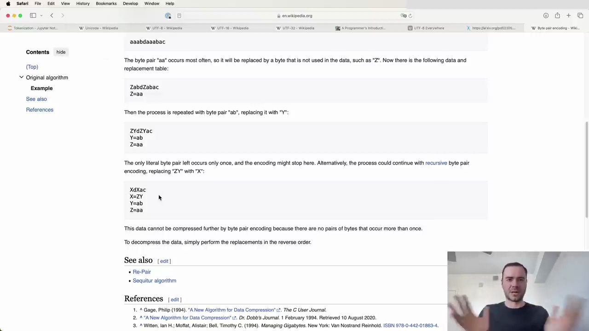

#  Byte Pair Encoding Algorithm Explained

Byte Pair Encoding (BPE) is a simple yet effective algorithm for compressing and tokenizing text data. It works by iteratively replacing the most frequent pair of bytes (or tokens) with a new byte that represents their concatenation. This process is repeated until a desired vocabulary size is reached or no more frequent pairs can be found.

## How BPE Works

Let's consider a simple example to understand how BPE works. Suppose we have a vocabulary of four elements: a, b, c, and d. Our input sequence is:

```
aaabdaaabac
```

We want to compress this sequence using BPE. Here's how the algorithm proceeds:

1. Find the most frequent pair of tokens. In this case, it's "aa".
2. Replace all occurrences of "aa" with a new token, say "Z". The sequence becomes:
   ```
   ZabdZabac
   ```
   Our vocabulary now includes: a, b, c, d, Z.

3. Repeat step 1. Let's say the most frequent pair is now "ab".
4. Replace all occurrences of "ab" with a new token, say "Y". The sequence becomes:
   ```
   ZYdZYac
   ```
   Our vocabulary now includes: a, b, c, d, Z, Y.

5. Repeat steps 1-4 until a desired vocabulary size is reached or no more frequent pairs can be found.



After the final iteration, our sequence is reduced to just five tokens, while our vocabulary has grown to seven elements.

## Applying BPE to Text Compression

In the context of text compression, we start with a vocabulary of 256 bytes. We then apply the BPE algorithm to iteratively find the most frequent byte pairs and mint new tokens for them. This process compresses the training data and provides an encoding scheme for arbitrary sequences.

To decompress the data, we simply perform the replacements in the reverse order.

