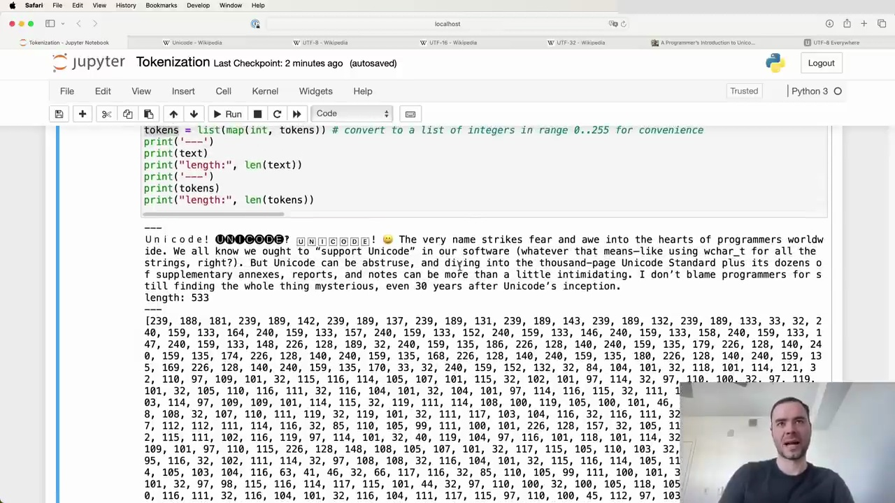
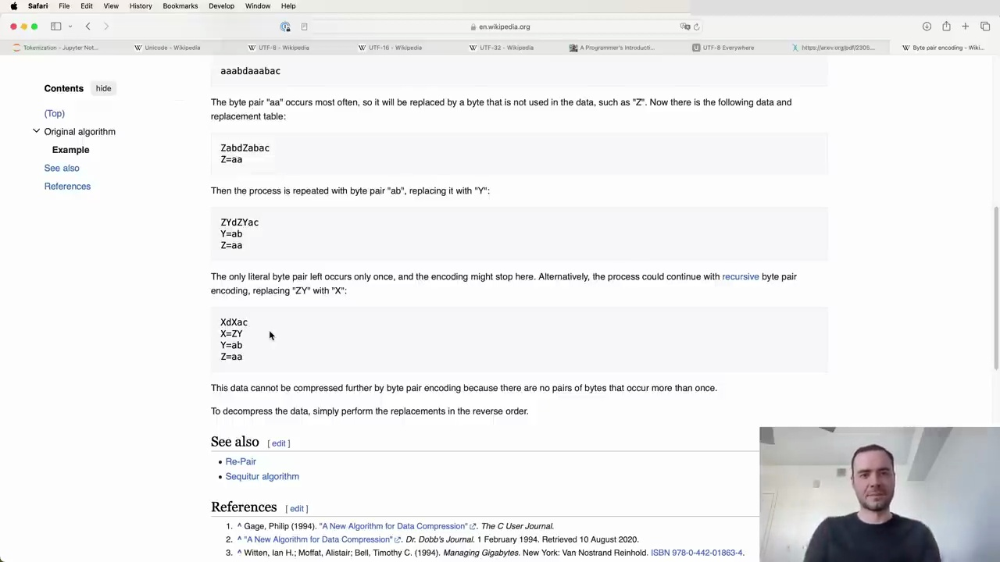

#  Byte Pair Encoding Algorithm

Byte Pair Encoding (BPE) is an algorithm used for tokenizing text data. It works by iteratively finding the most common pair of bytes in the data and merging them into a single token.

Here are the steps to implement BPE:

1. Start with the raw text data
2. Encode the text into UTF-8 bytes
3. Convert the bytes to a list of integers for easier manipulation in Python
   
4. Iterate over the list of integers and find the pair of bytes that occur most frequently
5. Merge the most frequent pair into a single token
6. Repeat steps 4-5 until a desired number of tokens is reached or no more pairs can be merged

For example, consider this text:

```
Unicode! 😀 The very name strikes fear and awe into the hearts of programmers worldwide. We all know we ought to "support Unicode" in our software (whatever that means—like using wchar_t for all the strings, right?). But Unicode can be abstruse, and diving into the thousand-page Unicode Standard plus its dozens of supplementary annexes, reports, and notes can be more than a little intimidating. I don't blame programmers for still finding the whole thing mysterious, even 30 years after Unicode's inception.
```

After encoding into UTF-8, the length increases from 533 characters to 616 bytes. This is because some Unicode characters take up multiple bytes in UTF-8.



The algorithm then proceeds to find the most common byte pairs and merge them into single tokens. This process is repeated until a desired vocabulary size is reached or no more pairs can be merged.

By iteratively merging frequent byte pairs, BPE can efficiently tokenize text data while keeping the vocabulary size manageable. It has become a popular choice for tokenization in natural language processing tasks.