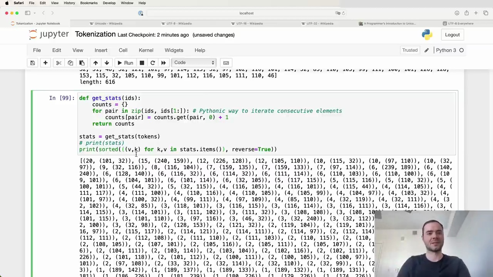

#  Pythonic Way to Iterate Consecutive Elements



In Python, there is a concise and efficient way to iterate over consecutive elements of a list using zip:

```python
def get_stats(ids):
    counts = {}
    for pair in zip(ids, ids[1:]):
        counts[pair] = counts.get(pair, 0) + 1
    return counts
```

This function `get_stats` takes a list of integers (`ids`) and returns a dictionary (`counts`) where the keys are tuples of consecutive elements and the values are the number of occurrences of each pair.

## Analyzing the Results

After calling `get_stats` on the list of tokens, we can print out the statistics in a more readable format:

```python
stats = get_stats(tokens)
print(sorted([(v,k) for k,v in stats.items()], reverse=True))
```

This sorts the dictionary items by value in descending order and prints them as (value, key) tuples. The output reveals that the most commonly occurring consecutive pair is `(101, 32)`, appearing 20 times in the list.

Using the `chr` function, we can convert these Unicode code points to their corresponding characters:

```python
chr(101)  # 'e'
chr(32)   # ' ' (space)
```

This shows that the most frequent pair is 'e' followed by a space, indicating that many words in the list end with the letter 'e'.

By analyzing the consecutive element pairs and their frequencies, we can gain insights into patterns and characteristics of the input data.