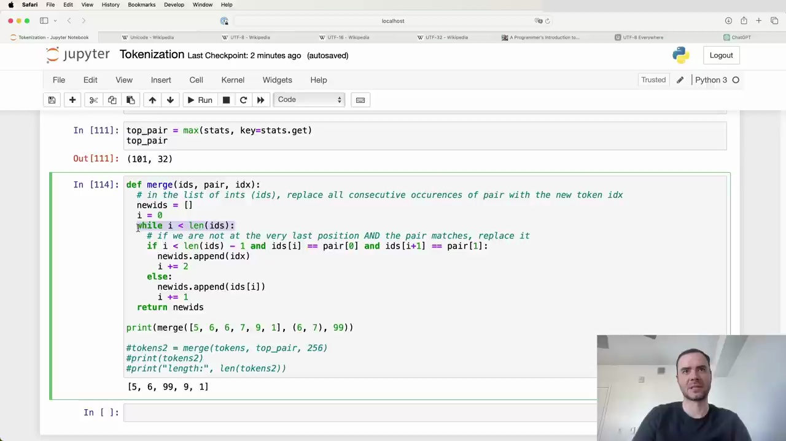

#  Tokenization and Merging Pairs

In this section, we will identify the most common pair of tokens in our sequence and merge them into a single new token. This process will be repeated iteratively to gradually build up a vocabulary of tokens.

## Finding the Most Common Pair

To find the most common pair of tokens, we can use the `max` function in Python on our `stats` dictionary. The `max` function will return the key with the maximum value, where the value is determined by the `stats.get` function which retrieves the count for each pair.

In our case, the most common pair is `(101, 32)`.

## Merging Pairs

To merge the `(101, 32)` pair, we will create a new token with ID `256` (since our current tokens go from 0 to 255) and replace all occurrences of `(101, 32)` with this new token.

Here is a function to perform this merging:

This function iterates through the list of token IDs from left to right. If it finds a match for the pair we want to replace, it appends the new token ID (`idx`) to a new list and increments the position by 2 to skip over the pair. Otherwise, it just copies the current token ID and increments by 1.

After applying this merging function to our `tokens` list with the `(101, 32)` pair and a new token ID of `256`, we get the following result:

The length of our token sequence has decreased from 616 to 596, which makes sense since there were 20 occurrences of the `(101, 32)` pair that have been replaced. We can also verify that `256` now appears in the merged sequence and `(101, 32)` no longer occurs.

## Iterative Merging

We can repeat this process of finding the most common pair and merging it into a new token iteratively to gradually build up our vocabulary. The number of iterations is a hyperparameter that can be tuned to find the optimal vocabulary size for our task.

As an example, large language models like GPT-4 currently use around 100,000 tokens, which has been found to work well in practice.

In the next section, we will put all these steps together into a loop to perform the iterative merging process.