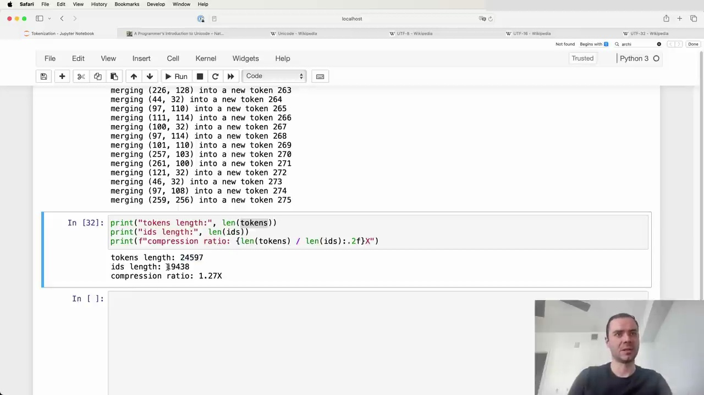
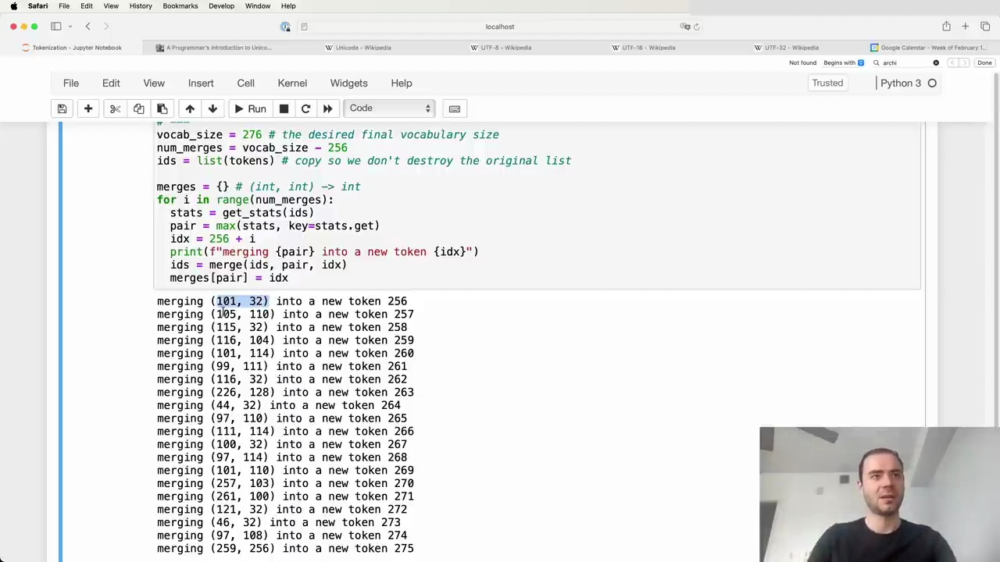

#  Byte Pair Encoding Tokenization

To achieve a greater compression ratio, we can increase the final vocabulary size of our tokenizer. In this example, we set the desired vocabulary size to 276, which means we will perform 20 merges on top of the initial 256 raw byte tokens.



The `merges` dictionary maintains the mapping of child tokens to their merged parent token. As we perform merges, we are building up a binary forest structure, starting with the individual bytes as leaves and merging them together.

For each of the 20 merges:
1. Find the most commonly occurring token pair
2. Assign a new integer token ID, starting from 256
3. Replace all occurrences of the pair with the new token
4. Record the merge in the `merges` dictionary

After performing the merges, the newly minted tokens are eligible for further merging in subsequent iterations. For example, the 20th merge combined tokens 259 and 256 into a new token 275.

## Compression Ratio

By applying byte pair encoding tokenization, we can achieve significant compression of the original text. In this case:

- Original text: 24,000 bytes
- Tokenized text (after 20 merges): 19,000 tokens

The compression ratio is calculated as:
```
compression_ratio = len(tokens) / len(ids)
                  = 24000 / 19000
                  = 1.27
```

With just 20 merges, we were able to compress the text by a factor of 1.27. Increasing the vocabulary size by adding more merge operations can lead to even higher compression ratios.



The byte pair encoding algorithm allows us to build an efficient tokenizer that can represent text using a smaller number of tokens while still capturing important subword units. This technique is widely used in modern natural language processing models to handle large vocabularies and reduce the computational complexity of working with raw text data.