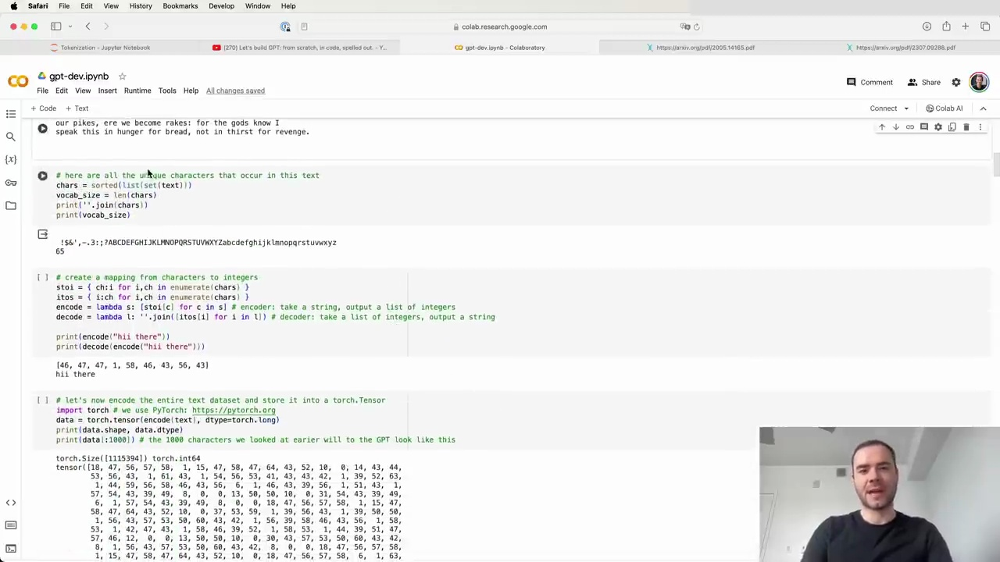
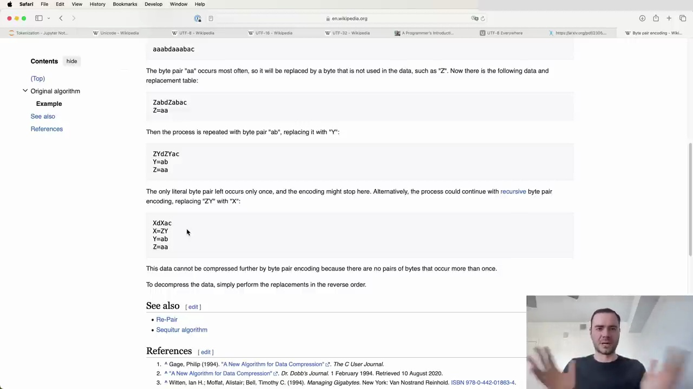

# [1) Tokenization in Large Language Models](https://www.youtube.com/watch?v=zduSFxRajkE&t=0s)


Tokenization is a fundamental concept in large language models (LLMs), but it can be a source of frustration for many working with these models. Despite being my least favorite part of working with LLMs, it is necessary to understand tokenization in some detail, as many of the oddities and issues encountered with LLMs can be traced back to tokenization.


## What is Tokenization?


Tokenization is the process of translating strings or text into sequences of tokens, which are the fundamental units of LLMs. In a previous video, "Let's Build GPT from Scratch," we performed a simple character-level tokenization:


1. We created a vocabulary of 65 possible characters from the Shakespeare dataset.

2. We created a lookup table to convert each character into an integer token.

3. We used an embedding table to map each token to a trainable vector that feeds into the Transformer.




<a href="https://www.youtube.com/watch?v=zduSFxRajkE&t=60s">Link to video</a>


However, state-of-the-art language models use more complicated tokenization schemes, such as byte pair encoding (BPE), which operates on chunks of characters rather than individual characters.


## The Importance of Tokenization in LLMs


The GPT-2 paper introduced byte-level encoding as a tokenization mechanism for LLMs. They used a vocabulary of 50,257 possible tokens and a context size of 1,024 tokens, meaning each token attends to the previous 1,024 tokens in the attention layer of the Transformer.


Tokenization is pervasive in LLMs, as evidenced by the Llama 2 paper, which mentions "token" 63 times. They trained on two trillion tokens of data, highlighting the importance of tokenization in these models.


<a href="https://www.youtube.com/watch?v=zduSFxRajkE&t=240s">Link to video</a>


## Complexities and Issues Arising from Tokenization


Many issues encountered with LLMs can be traced back to tokenization, such as:


- Difficulty with spelling tasks

- Challenges in simple string processing

- Worse performance on non-English languages

- Issues with simple arithmetic

- Weird warnings about trailing whitespace

- Unrelated tangents in responses (e.g., "solid gold Magikarp")

- Recommendations to use YAML over JSON for structured data


In the next sections, we will dive deeper into the byte pair encoding algorithm and build our own tokenizer from scratch to gain a better understanding of this crucial component of large language models.


# [2) Tokenization in Large Language Models](https://www.youtube.com/watch?v=zduSFxRajkE&t=350s)


Let's start with a simple example. If we input the string "hello world" into the Tik tokenizer using the GPT-2 tokenizer, we see that it breaks down into 300 tokens:


<a href="https://www.youtube.com/watch?v=zduSFxRajkE&t=410s">Link to video</a>


Each token is represented by a unique ID. For instance, the word "tokenization" becomes two tokens: 3,642 and 1,634. Spaces are also tokenized, with the token ID 318.


It's important to note that tokenization can be case-sensitive and context-dependent. For example, "egg" by itself is two tokens, but "a egg" is a single token.


## Tokenization in Non-English Languages


Non-English languages often have worse tokenization in LLMs due to the training data being skewed towards English. This results in longer token sequences for the same amount of information in non-English text.


<a href="https://www.youtube.com/watch?v=zduSFxRajkE&t=770s">Link to video</a>


As you can see, the Korean text here is broken up into many more tokens compared to an equivalent English sentence. This bloats the sequence length and can cause issues with the model running out of context.


## Tokenization in Programming Languages


Tokenization can also have a significant impact on how well LLMs handle programming languages. In the example below, we see how Python code is tokenized using the GPT-2 tokenizer:


<a href="https://www.youtube.com/watch?v=zduSFxRajkE&t=530s">Link to video</a>


Each individual space is a separate token (ID 220), which is extremely wasteful. This is one reason why GPT-2 struggles with Python code.


However, the GPT-4 tokenizer handles whitespace in Python much more efficiently:


<a href="https://www.youtube.com/watch?v=zduSFxRajkE&t=890s">Link to video</a>


Here, multiple spaces are grouped into a single token, making the input denser and allowing the model to attend to more code within its context window.


# [3) Tokenization: Encoding Text for Language Models](https://www.youtube.com/watch?v=zduSFxRajkE&t=896s)


Language models require text to be tokenized into integers that map to a fixed vocabulary. This process is more complex than simply using the Unicode standard, as it needs to support various languages, special characters, and emojis found on the internet. Let's explore how to properly tokenize text for use in Transformers.


## Unicode and Code Points


Strings in Python are immutable sequences of Unicode code points. The Unicode Consortium defines roughly 150,000 characters across 161 scripts in the Unicode standard. Each character is assigned a unique integer code point.


We can access the Unicode code point of a single character using Python's `ord()` function:


<a href="https://www.youtube.com/watch?v=zduSFxRajkE&t=1016s">Link to video</a>


For example, `ord("H")` returns `104`, while more complex characters like emojis have much higher code points, such as `128514` for 😂.


However, directly using Unicode code points for tokenization has some drawbacks:


1. The vocabulary would be quite large, around 150,000 different code points.

2. The Unicode standard is constantly evolving, making it an unstable representation.


Therefore, we need a better tokenization method for language models.


## Tokenization for Language Models


A more suitable approach is to use a tokenizer specifically designed for language models. These tokenizers aim to provide a stable, efficient representation of text that can handle various languages and character sets.


<a href="https://www.youtube.com/watch?v=zduSFxRajkE&t=1076s">Link to video</a>


Some key aspects of tokenization for language models include:


- Mapping to legacy character sets for interoperability with existing software

- Providing inclusive mappings between characters in legacy sets and Unicode

- Handling inconsistent legacy architectures and precomposed characters

- Supporting a wide range of encoding forms for Korean Hangul


By using a well-designed tokenizer, we can convert text into a sequence of integers that can be fed into the Transformer model as input. This allows the model to process and understand a wide variety of text, including different languages and special characters.


In summary, tokenization is a crucial step in preparing text for use in language models. While the Unicode standard provides a foundation, specialized tokenizers are needed to create a stable and efficient representation suitable for Transformers and other NLP tasks.
# [4) A Programmer's Introduction to Unicode](https://www.youtube.com/watch?v=zduSFxRajkE&t=1095s)


<a href="https://www.youtube.com/watch?v=zduSFxRajkE&t=1155s">Link to video</a>


Unicode is a very important concept for programmers worldwide. We all know we ought to "support Unicode" in our software (whatever that means—like using wchar_t for all the strings, right?). But Unicode can be abstruse, and diving into the thousand-page Unicode Standard plus its dozens of supplementary annexes, reports, and notes can be more than a little intimidating. I don't blame programmers for still finding the whole thing mysterious, even 30 years after Unicode's inception.


A few months ago, I got interested in Unicode and decided to spend some time learning more about it in detail. In this article, I'll give an introduction to it from a programmer's point of view.


I'm going to focus on the character set and what's involved in working with string and files of Unicode text. However, in this article I'm not going to talk about fonts, text layout/shaping/rendering, or localization in detail—those are separate issues, beyond my scope (and knowledge) here.


## Contents


- Diversity and Inherent Complexity

- The Unicode Codespace

- Codespace Allocation

- Scripts

- Usage Frequency

- Encodings

- UTF-8

- UTF-16

- Combining Marks

- Canonical Equivalence

- Normalization Forms

- Grapheme Clusters

- And More...


## UTF-8 Encoding


UTF-8 is by far the most common Unicode encoding. This Wikipedia page is quite long, but what's important for our purposes is that UTF-8 takes every single code point and translates it to a byte stream between 1 to 4 bytes. It's a variable length encoding, so depending on the Unicode code point, you'll end up with between 1 to 4 bytes for each code point.


Let's try encoding a string to UTF-8 in Python:


<a href="https://www.youtube.com/watch?v=zduSFxRajkE&t=1215s">Link to video</a>


The string class has an `encode()` method where you can specify the encoding like "utf-8". This returns a bytes object, which isn't very nicely printed. I personally like to pass it through `list()` to see the raw bytes of the encoding.


We can compare this to UTF-16 and UTF-32 encodings:


<a href="https://www.youtube.com/watch?v=zduSFxRajkE&t=1275s">Link to video</a>


With UTF-16 and UTF-32, we start to see some of their disadvantages. There are a lot of zero bytes, especially for simple ASCII/English characters. It's a bit wasteful.


## Byte Pair Encoding


If we just used the raw UTF-8 bytes naively, that would imply a vocabulary size of only 256 possible tokens. This is very small, and would result in our text being stretched out over very long sequences of bytes.


While the embedding table and final prediction layer would be tiny, our sequences would become very long. We have pretty finite context length and attention that we can support in a transformer for computational reasons. So we only have so much context length to work with, but now have very long sequences. It's inefficient and won't allow us to attend to sufficiently long text.


We don't want to use the raw UTF-8 bytes. We want to support a larger vocabulary size that we can tune as a hyperparameter, while still sticking with the UTF-8 encoding.


The solution is to use the byte pair encoding (BPE) algorithm. This will allow us to compress these byte sequences to a variable amount.


<a href="https://www.youtube.com/watch?v=zduSFxRajkE&t=1335s">Link to video</a>


BPE enables us to tune the vocabulary size as a hyperparameter and compress the UTF-8 byte streams accordingly. We'll get more into the details of how BPE works in a bit. But this provides a nice balance - sticking with UTF-8 encoding while having control over the vocab size.


In summary:

- Unicode is a complex but important topic for programmers to understand 

- UTF-8 is the most common and preferred Unicode encoding

- Using raw UTF-8 bytes leads to very long sequences and tiny vocab sizes

- Byte pair encoding allows compressing UTF-8 streams while tuning the vocabulary size


Next up, we'll dive deeper into exactly how the BPE algorithm works to achieve this. Stay tuned!
# [5) Tokenization-Free Language Modeling](https://www.youtube.com/watch?v=zduSFxRajkE&t=1367s)


Feeding raw byte sequences into language models is an attractive idea, but it comes with some hurdles:


- Attention becomes extremely expensive due to the long sequences

- Modifications to the Transformer architecture are required


A paper from last summer proposed a hierarchical structuring of the Transformer to enable feeding in raw bytes. The authors state:


> "Together these results establish the viability of tokenization-free autoregressive sequence modeling at scale."


However, this approach has not yet been widely proven at sufficient scale by many research groups.


## The Need for Tokenization


Given the current limitations, we still need to compress the input using tokenization algorithms like Byte Pair Encoding (BPE) before feeding it into language models. Here's an example of how the BPE algorithm works in Python:


<a href="https://www.youtube.com/watch?v=zduSFxRajkE&t=1427s">Link to video</a>


The code demonstrates the `list()` function being called with a string argument `"안녕하세요 (hello in Korean)"` and the `encode("utf-8")` method to convert it into a byte sequence.


## Looking Ahead


Tokenization-free language modeling holds great promise for simplifying and streamlining the input process. If successful, we could feed byte streams directly into our models without the need for tokenization steps.


While more research and validation are needed, the potential benefits make this an exciting area to watch. I hope to see further developments that bring us closer to realizing tokenization-free modeling at scale.
# [6) Byte Pair Encoding Algorithm Explained](https://www.youtube.com/watch?v=zduSFxRajkE&t=1430s)


Byte Pair Encoding (BPE) is a simple yet effective algorithm for compressing and tokenizing text data. It works by iteratively replacing the most frequent pair of bytes (or tokens) with a new byte that represents their concatenation. This process is repeated until a desired vocabulary size is reached or no more frequent pairs can be found.


## How BPE Works


Let's consider a simple example to understand how BPE works. Suppose we have a vocabulary of four elements: a, b, c, and d. Our input sequence is:


```

aaabdaaabac

```


We want to compress this sequence using BPE. Here's how the algorithm proceeds:


1. Find the most frequent pair of tokens. In this case, it's "aa".

2. Replace all occurrences of "aa" with a new token, say "Z". The sequence becomes:

   ```

   ZabdZabac

   ```

   Our vocabulary now includes: a, b, c, d, Z.


3. Repeat step 1. Let's say the most frequent pair is now "ab".

4. Replace all occurrences of "ab" with a new token, say "Y". The sequence becomes:

   ```

   ZYdZYac

   ```

   Our vocabulary now includes: a, b, c, d, Z, Y.


5. Repeat steps 1-4 until a desired vocabulary size is reached or no more frequent pairs can be found.




<a href="https://www.youtube.com/watch?v=zduSFxRajkE&t=1610s">Link to video</a>


After the final iteration, our sequence is reduced to just five tokens, while our vocabulary has grown to seven elements.


## Applying BPE to Text Compression


In the context of text compression, we start with a vocabulary of 256 bytes. We then apply the BPE algorithm to iteratively find the most frequent byte pairs and mint new tokens for them. This process compresses the training data and provides an encoding scheme for arbitrary sequences.


To decompress the data, we simply perform the replacements in the reverse order.


# [7) Byte Pair Encoding Algorithm](https://www.youtube.com/watch?v=zduSFxRajkE&t=1622s)


Byte Pair Encoding (BPE) is an algorithm used for tokenizing text data. It works by iteratively finding the most common pair of bytes in the data and merging them into a single token.


Here are the steps to implement BPE:


1. Start with the raw text data

2. Encode the text into UTF-8 bytes

3. Convert the bytes to a list of integers for easier manipulation in Python

   

<a href="https://www.youtube.com/watch?v=zduSFxRajkE&t=1682s">Link to video</a>

4. Iterate over the list of integers and find the pair of bytes that occur most frequently

5. Merge the most frequent pair into a single token

6. Repeat steps 4-5 until a desired number of tokens is reached or no more pairs can be merged


For example, consider this text:


```

Unicode! 😀 The very name strikes fear and awe into the hearts of programmers worldwide. We all know we ought to "support Unicode" in our software (whatever that means—like using wchar_t for all the strings, right?). But Unicode can be abstruse, and diving into the thousand-page Unicode Standard plus its dozens of supplementary annexes, reports, and notes can be more than a little intimidating. I don't blame programmers for still finding the whole thing mysterious, even 30 years after Unicode's inception.

```


After encoding into UTF-8, the length increases from 533 characters to 616 bytes. This is because some Unicode characters take up multiple bytes in UTF-8.


<a href="https://www.youtube.com/watch?v=zduSFxRajkE&t=1622s">Link to video</a>


The algorithm then proceeds to find the most common byte pairs and merge them into single tokens. This process is repeated until a desired vocabulary size is reached or no more pairs can be merged.


By iteratively merging frequent byte pairs, BPE can efficiently tokenize text data while keeping the vocabulary size manageable. It has become a popular choice for tokenization in natural language processing tasks.
# [8) Pythonic Way to Iterate Consecutive Elements](https://www.youtube.com/watch?v=zduSFxRajkE&t=1715s)


<a href="https://www.youtube.com/watch?v=zduSFxRajkE&t=1775s">Link to video</a>


In Python, there is a concise and efficient way to iterate over consecutive elements of a list using zip:


```python

def get_stats(ids):

    counts = {}

    for pair in zip(ids, ids[1:]):

        counts[pair] = counts.get(pair, 0) + 1

    return counts

```


This function `get_stats` takes a list of integers (`ids`) and returns a dictionary (`counts`) where the keys are tuples of consecutive elements and the values are the number of occurrences of each pair.


## Analyzing the Results


After calling `get_stats` on the list of tokens, we can print out the statistics in a more readable format:


```python

stats = get_stats(tokens)

print(sorted([(v,k) for k,v in stats.items()], reverse=True))

```


This sorts the dictionary items by value in descending order and prints them as (value, key) tuples. The output reveals that the most commonly occurring consecutive pair is `(101, 32)`, appearing 20 times in the list.


Using the `chr` function, we can convert these Unicode code points to their corresponding characters:


```python

chr(101)  # 'e'

chr(32)   # ' ' (space)

```


This shows that the most frequent pair is 'e' followed by a space, indicating that many words in the list end with the letter 'e'.


By analyzing the consecutive element pairs and their frequencies, we can gain insights into patterns and characteristics of the input data.
# [9) Tokenization and Merging Pairs](https://www.youtube.com/watch?v=zduSFxRajkE&t=1836s)


In this section, we will identify the most common pair of tokens in our sequence and merge them into a single new token. This process will be repeated iteratively to gradually build up a vocabulary of tokens.


## Finding the Most Common Pair


To find the most common pair of tokens, we can use the `max` function in Python on our `stats` dictionary. The `max` function will return the key with the maximum value, where the value is determined by the `stats.get` function which retrieves the count for each pair.


<a href="https://www.youtube.com/watch?v=zduSFxRajkE&t=1956s">Link to video</a>


In our case, the most common pair is `(101, 32)`.


## Merging Pairs


To merge the `(101, 32)` pair, we will create a new token with ID `256` (since our current tokens go from 0 to 255) and replace all occurrences of `(101, 32)` with this new token.


Here is a function to perform this merging:


<a href="https://www.youtube.com/watch?v=zduSFxRajkE&t=2016s">Link to video</a>


This function iterates through the list of token IDs from left to right. If it finds a match for the pair we want to replace, it appends the new token ID (`idx`) to a new list and increments the position by 2 to skip over the pair. Otherwise, it just copies the current token ID and increments by 1.


After applying this merging function to our `tokens` list with the `(101, 32)` pair and a new token ID of `256`, we get the following result:


<a href="https://www.youtube.com/watch?v=zduSFxRajkE&t=2076s">Link to video</a>


The length of our token sequence has decreased from 616 to 596, which makes sense since there were 20 occurrences of the `(101, 32)` pair that have been replaced. We can also verify that `256` now appears in the merged sequence and `(101, 32)` no longer occurs.


## Iterative Merging


We can repeat this process of finding the most common pair and merging it into a new token iteratively to gradually build up our vocabulary. The number of iterations is a hyperparameter that can be tuned to find the optimal vocabulary size for our task.


As an example, large language models like GPT-4 currently use around 100,000 tokens, which has been found to work well in practice.


In the next section, we will put all these steps together into a loop to perform the iterative merging process.
# [10) Byte Pair Encoding Tokenization](https://www.youtube.com/watch?v=zduSFxRajkE&t=2098s)


To achieve a greater compression ratio, we can increase the final vocabulary size of our tokenizer. In this example, we set the desired vocabulary size to 276, which means we will perform 20 merges on top of the initial 256 raw byte tokens.


<a href="https://www.youtube.com/watch?v=zduSFxRajkE&t=2338s">Link to video</a>


The `merges` dictionary maintains the mapping of child tokens to their merged parent token. As we perform merges, we are building up a binary forest structure, starting with the individual bytes as leaves and merging them together.


For each of the 20 merges:

1. Find the most commonly occurring token pair

2. Assign a new integer token ID, starting from 256

3. Replace all occurrences of the pair with the new token

4. Record the merge in the `merges` dictionary


After performing the merges, the newly minted tokens are eligible for further merging in subsequent iterations. For example, the 20th merge combined tokens 259 and 256 into a new token 275.


## Compression Ratio


By applying byte pair encoding tokenization, we can achieve significant compression of the original text. In this case:


- Original text: 24,000 bytes

- Tokenized text (after 20 merges): 19,000 tokens


The compression ratio is calculated as:

```

compression_ratio = len(tokens) / len(ids)

                  = 24000 / 19000

                  = 1.27

```


With just 20 merges, we were able to compress the text by a factor of 1.27. Increasing the vocabulary size by adding more merge operations can lead to even higher compression ratios.


<a href="https://www.youtube.com/watch?v=zduSFxRajkE&t=2278s">Link to video</a>


The byte pair encoding algorithm allows us to build an efficient tokenizer that can represent text using a smaller number of tokens while still capturing important subword units. This technique is widely used in modern natural language processing models to handle large vocabularies and reduce the computational complexity of working with raw text data.
# [11) Tokenizers and Language Models](https://www.youtube.com/watch?v=zduSFxRajkE&t=2360s)


<a href="https://www.youtube.com/watch?v=zduSFxRajkE&t=2480s">Link to video</a>


The Tokenizer is a completely separate, independent module from the Language Model (LLM). It has its own training dataset of text (which could be different from that of the LLM), on which you train the vocabulary using the Byte Pair Encoding (BPE) algorithm. It then translates back and forth between raw text and sequences of tokens. The LLM later only ever sees the tokens and never directly deals with any text.


## Encoding and Decoding with Tokenizers


Once the Tokenizer is trained and you have the vocabulary and merges, you can do both encoding and decoding:


- Encoding: Given raw text, the Tokenizer can turn it into a token sequence

- Decoding: Given a token sequence, the Tokenizer can translate it back into raw text


This allows translating between the realms of raw text (Unicode code point sequences) and token sequences that the LLM operates on.


## Tokenizer Training Considerations


When training the Tokenizer, you may want to consider using a training set with a mixture of different languages and code/non-code data. The amount of each type of data will determine how many merges there will be and the density of representation in token space.


For example, including a large amount of Japanese text in the Tokenizer training set will result in more Japanese tokens getting merged. This leads to shorter token sequences for Japanese, which is beneficial for the LLM that has a finite context length it can process in token space.


## Tokenization as a Preprocessing Step


<a href="https://www.youtube.com/watch?v=zduSFxRajkE&t=2540s">Link to video</a>


A common approach is to take all the LLM training data and run it through the trained Tokenizer as a massive preprocessing step. This translates everything into token sequences which are stored on disk. The raw text can then be discarded, as the LLM only reads the tokens during its own training.


In summary, the Tokenizer is a crucial but completely separate component from the Language Model itself. With proper training that considers the target data mix, it enables efficient encoding of text into token sequences that LLMs can process.
# [12) Decoding UTF-8 Tokens to Text](https://www.youtube.com/watch?v=zduSFxRajkE&t=2567s)


Given a sequence of integers in the range [0, vocab_size], we can decode them back into the original text using the following Python function:


<a href="https://www.youtube.com/watch?v=zduSFxRajkE&t=2867s">Link to video</a>


```python

def decode(ids):

    # given ids (list of integers), return Python string

    tokens = b"".join(vocab[idx] for idx in ids)

    text = tokens.decode("utf-8", errors="replace")

    return text

```


The key steps are:


1. Create a `vocab` dictionary mapping token IDs to their byte representation.

2. Iterate over the input `ids` and look up the corresponding bytes in `vocab`.

3. Concatenate the bytes together into a single `tokens` byte string.

4. Decode the `tokens` byte string into a Python string using UTF-8 decoding.


## Handling Invalid UTF-8 Sequences


One tricky aspect is that not every possible byte sequence is a valid UTF-8 encoding. For example:


<a href="https://www.youtube.com/watch?v=zduSFxRajkE&t=2807s">Link to video</a>


Trying to decode the single token ID 128 results in an error:


```

UnicodeDecodeError: 'utf-8' codec can't decode byte 0x80 in position 0: invalid start byte

```


This is because the binary representation of 128 (10000000) does not conform to the UTF-8 format, which requires multi-byte sequences to have a specific envelope structure.


To handle this, we can pass `errors="replace"` to the `str.decode()` method, which will replace invalid bytes with the Unicode replacement character (�). This is the standard practice used in code released by OpenAI and others.


By following this decoding process, we can convert the integer token sequence output by the language model back into human-readable text, with some tolerance for occasional invalid byte sequences.
# [13) Byte Pair Encoding Algorithm](https://www.youtube.com/watch?v=zduSFxRajkE&t=2901s)


The Byte Pair Encoding (BPE) algorithm is used to train a tokenizer for language models. The process involves taking a training set, creating a dictionary of merges, and using this to encode and decode between raw text and token sequences.


## Training the Tokenizer


The parameters of the tokenizer are stored in a dictionary of merges, which creates a binary forest on top of raw bytes. The training process follows these steps:


1. Take the training text and encode it into UTF-8 bytes.

2. Convert the bytes into a list of integers.

3. Build a dictionary that counts the frequency of each consecutive pair of bytes.

4. Iteratively merge the most frequent pair and update the dictionary until a desired vocabulary size is reached.


<a href="https://www.youtube.com/watch?v=zduSFxRajkE&t=3021s">Link to video</a>


## Encoding and Decoding


Once the merges table is created, it can be used to both encode and decode between raw text and token sequences.


To encode a string:


1. Encode the text into UTF-8 and convert to a list of integers.

2. Iteratively merge pairs of tokens according to the merges dictionary, starting with the earliest merges.

3. Return the final list of tokens.


<a href="https://www.youtube.com/watch?v=zduSFxRajkE&t=3381s">Link to video</a>


To decode a sequence of tokens:


1. Iteratively split tokens according to the merges dictionary, starting with the latest merges.

2. Convert the resulting list of integers into bytes.

3. Decode the bytes using UTF-8 to get the original text.


It's important to note that while encoding and then decoding a string will result in the same string, the reverse is not always true. Not all token sequences are valid UTF-8 byte streams, so some may not be decodable.


## Complexities in Real-World Tokenizers


While the basic BPE algorithm is straightforward, the tokenizers used in state-of-the-art language models can be much more complex. The picture complexifies quickly, with various modifications and extensions to the basic algorithm.


<a href="https://www.youtube.com/watch?v=zduSFxRajkE&t=3441s">Link to video</a>


Understanding these complexities is crucial for working with modern language models effectively. The details of these modifications will be explored further in subsequent sections.
# [14) Tokenization in GPT-2](https://www.youtube.com/watch?v=zduSFxRajkE&t=3456s)


GPT-2 uses a modified version of the byte pair encoding (BPE) algorithm for tokenization. The paper discusses the input representation and how they enforce certain merging rules on top of the BPE algorithm to prevent suboptimal clustering of tokens.


## Enforcing Merging Rules


The GPT-2 tokenizer code uses a complex regex pattern to enforce rules for what parts of the text will never be merged:


<a href="https://www.youtube.com/watch?v=zduSFxRajkE&t=4212s">Link to video</a>


This pattern splits the input text into chunks, and the BPE algorithm is applied independently within each chunk. The results are then concatenated to form the final tokenized sequence. This prevents merges across certain character types, such as letters, numbers, and punctuation.


## Analyzing the Regex Pattern


The regex pattern uses the `reex` package, an extension of Python's `re` module. It consists of several alternatives separated by `|` (OR) operators. The pattern matches the following, in order:


1. Apostrophe contractions (e.g., `'s`, `'t`)

2. Letters (`\p{L}`)

3. Numbers (`\p{N}`)

4. Non-letter, non-number, non-space characters (punctuation)

5. Whitespace up to but not including the last whitespace character


Here's an example of how the pattern splits a string:


<a href="https://www.youtube.com/watch?v=zduSFxRajkE&t=4296s">Link to video</a>


The tokenizer separates letters, numbers, punctuation, and whitespace into different chunks, preventing merges across these categories.


## Inconsistencies and Limitations


The GPT-2 tokenizer has some inconsistencies and limitations:


- It is hardcoded for specific apostrophe types and may not handle Unicode apostrophes correctly.

- The apostrophe handling is case-sensitive, leading to inconsistent tokenization for uppercase and lowercase contractions.

- The apostrophe rules are language-specific and may not work well for all languages.


## Training the Tokenizer


The exact training process for the GPT-2 tokenizer is not fully known, as the training code was never released. The available code is only for inference, applying pre-trained merges to new text. It is evident that OpenAI enforced additional rules beyond chunking and BPE, such as never merging whitespace characters.


<a href="https://www.youtube.com/watch?v=zduSFxRajkE&t=4128s">Link to video</a>


In conclusion, the GPT-2 tokenizer uses a modified BPE algorithm with additional rules to prevent suboptimal merging of tokens. While it has some limitations and inconsistencies, it aims to improve the tokenization process for the language model.
# [15) Tokenization with Tiktoken](https://www.youtube.com/watch?v=zduSFxRajkE&t=4298s)


OpenAI provides an official library for tokenization called Tiktoken. To use it, first install the package:


```

pip install tiktoken

```


Tiktoken can be used for tokenization during inference (not training). Here's a simple example of using Tiktoken to compare the tokenization of GPT-2 vs GPT-4:


<a href="https://www.youtube.com/watch?v=zduSFxRajkE&t=4478s">Link to video</a>


Running this code will output the tokens for both the GPT-2 and GPT-4 tokenizers. A key difference is that whitespace remains unmerged in GPT-2 tokens, while it becomes merged in GPT-4 tokens.


## Changes in GPT-4 Tokenizer


The GPT-4 tokenizer, referred to as `cl100k_base`, has some notable changes compared to the GPT-2 tokenizer. These changes can be found in the `tiktoken/tiktoken_ext/openai_public.py` file, which contains the definitions for the various tokenizers maintained by OpenAI.


<a href="https://www.youtube.com/watch?v=zduSFxRajkE&t=4418s">Link to video</a>


Some of the major changes in the GPT-4 tokenizer include:


1. Case-insensitive matching for apostrophes (e.g., `'s`, `'d`, `'m`).

2. Different handling of whitespace (details not specified).

3. Numbers are only merged when they are 1-3 digits long, preventing very long number sequences from being merged.


The vocabulary size has also increased from roughly 50k in GPT-2 to around 100k in GPT-4.


It's important to note that the reasoning behind these changes is not documented, and the information provided is based on the patterns observed in the tokenizer definitions.
# [16) GPT-2 Encoder Implementation](https://www.youtube.com/watch?v=zduSFxRajkE&t=4499s)


OpenAI has released the `encoder.py` file as part of their GPT-2 model. This file contains the implementation of the tokenizer used in GPT-2. Let's take a closer look at how it works.


## Tokenizer Components


The GPT-2 tokenizer consists of two main components:


1. **Encoder**: This is equivalent to our `vocab` object, which allows efficient decoding by mapping integers to bytes.


2. **Vocab BPE**: Despite the confusing name, this is actually equivalent to our `merges` variable. It contains the byte pair encoding (BPE) merges based on the data inside `vocab.bpe`.


<a href="https://www.youtube.com/watch?v=zduSFxRajkE&t=4679s">Link to video</a>


## Encoding and Decoding Process


The encoding and decoding process in the GPT-2 tokenizer involves the following steps:


1. Byte Encoding: The input is first passed through a byte encoder.

2. Encoding: The byte-encoded input is then encoded using the tokenizer.

3. Decoding: The encoded tokens are decoded using the tokenizer.

4. Byte Decoding: The decoded output is finally passed through a byte decoder.


It's worth noting that the byte encoder and byte decoder are not particularly interesting or deep implementation details. They are simply stacked serially on top of the tokenizer.


## BPE Function


The core of the `encoder.py` file lies in the `bpe` function. This function is similar to our own implementation, where it identifies the next bigram pair to merge. It iterates over the sequence and merges the pair whenever it is found. This process is repeated until no more merges are possible in the text.


## Encode and Decode Functions


The `encoder.py` file also includes `encode` and `decode` functions, just like we have implemented. These functions handle the encoding and decoding of the input using the tokenizer.


## Conclusion


While the code in `encoder.py` may appear a bit messy, it is algorithmically identical to what we have built. Understanding our own implementation provides a solid foundation for comprehending the GPT-2 tokenizer. The key takeaway is that the tokenizer consists of the `vocab` and `merges` variables, which are used for encoding and decoding the input.
# [17) Special Tokens in Tokenization](https://www.youtube.com/watch?v=zduSFxRajkE&t=4706s)


When tokenizing text, in addition to tokens derived from raw bytes and byte pair encoding (BPE) merges, special tokens can be inserted to delimit different parts of the data or create a special structure in the token stream.


## OpenAI's GPT-2 Tokenizer


The `encoder` object from OpenAI's GPT-2 tokenizer has a length of 50,257. This number comes from:

- 256 raw byte tokens

- 50,000 BPE merge tokens

- 1 special token: "end of text" (token ID 50256)


The "end of text" token is used to delimit documents in the training set. It signals to the language model that the document has ended and what follows is unrelated to the previous document. The model learns from the data that this token indicates it should reset its memory of the preceding context.


<a href="https://www.youtube.com/watch?v=zduSFxRajkE&t=5126s">Link to video</a>


## Extending the Tokenizer


The `tiktoken` library allows extending the tokenizer by adding more special tokens. These tokens can be used to delimit conversations between an assistant and a user in fine-tuned models like GPT-3.5 Turbo.


To extend the tokenizer:

1. Fork the base tokenizer (e.g., cl100k_base for GPT-4)

2. Add arbitrary special tokens with new IDs

3. The `tiktoken` library will swap them out when encountered in strings


## Model Surgery for Special Tokens


When adding special tokens, the language model's architecture needs to be adjusted:

- Extend the embedding matrix by adding a row for each new token, initialized with small random numbers

- Extend the final layer's projection (classifier) by the number of added tokens


This model surgery is a common operation when fine-tuning a base model into a chat model like ChatGPT.


By leveraging special tokens, language models can be adapted to handle structured conversations and delimit various parts of the input data, enabling more advanced applications beyond simple next-token prediction.
# [18) Building a GPT-4 Tokenizer](https://www.youtube.com/watch?v=zduSFxRajkE&t=5128s)


<a href="https://www.youtube.com/watch?v=zduSFxRajkE&t=5308s">Link to video</a>


The process of developing a GPT-4 tokenizer can be broken down into four steps. The code for this exercise is available in the MBP repository on GitHub. The repository includes tests and clean, understandable code to reference if you get stuck.


Once you have written your tokenizer, you should be able to reproduce the behavior of the `tiktoken` library:


- Encode a string and get the corresponding tokens

- Encode and decode a string to recover the original text

- Implement your own `train` function to train token vocabularies (not provided by `tiktoken`)


## Comparing Token Vocabularies


The MBP repository shows examples of the token vocabularies you might obtain when training your own tokenizer. The first 256 tokens are raw individual bytes. The remaining tokens represent the merges performed by the tokenizer during training, in the order they occurred.


For example, the first merge GPT-4 performed was combining two spaces into a single token (token 256). Similarly, in the MBP tokenizer trained on a Wikipedia page about Taylor Swift, the merge of "space t" into "space t" happened a bit later.


<a href="https://www.youtube.com/watch?v=zduSFxRajkE&t=5248s">Link to video</a>


The differences in the merge order are due to the different training sets used. GPT-4 likely had a lot of Python code in its training set, based on the prevalence of whitespace tokens. In contrast, the Wikipedia-trained tokenizer shows fewer whitespace-related merges.


Despite the differences, the resulting vocabularies look similar because they are generated using the same algorithm. When you train your own tokenizer, you can expect to see comparable results, with variations depending on your training data.


## Next Steps


With this knowledge, you now have everything you need to build your own GPT-4 tokenizer. Follow the exercise progression in the MBP repository, referencing the provided code and tests whenever you need guidance. Happy coding!
# [19) Exploring Sentence Piece Tokenization for Language Models](https://www.youtube.com/watch?v=zduSFxRajkE&t=5322s)


Sentence Piece is a commonly used library for tokenization in language models, supporting both training and inference. It is used by models like Llama and Mistal series. Let's explore how Sentence Piece differs from Tik Token in its approach to tokenization.


## Sentence Piece vs Tik Token


The key difference between Sentence Piece and Tik Token is in the order of operations:


- Tik Token first takes the code points in the string, encodes them using mutf to bytes, and then merges bytes. 

- Sentence Piece works directly at the level of code points. It looks at the code points available in the training set and starts merging those code points.


<a href="https://www.youtube.com/watch?v=zduSFxRajkE&t=5498s">Link to video</a>


Sentence Piece runs byte pair encoding (BPE) on the code points. For rare code points that don't appear often (determined by the `character_coverage` hyperparameter), it either maps them to a special unknown token like `<unk>`, or if `byte_fallback` is turned on, it encodes those rare code points using UTF-8 and translates the individual bytes into special byte tokens added to the vocabulary.


## Training a Sentence Piece Model


To train a Sentence Piece model, you provide a text file and specify various options:


<a href="https://www.youtube.com/watch?v=zduSFxRajkE&t=5850s">Link to video</a>


Some key options used in the Llama 2 tokenizer:


- `input`: path to the raw text file 

- `model_prefix`: output filename prefix

- `model_type`: algorithm (e.g. `BPE`)

- `vocab_size`: desired vocabulary size

- normalization and pre-processing rules

- `split_by_whitespace`, `split_by_number`, etc.: rules for splitting digits, whitespace, numbers

- special tokens: `unk_id`, `bos_id`, etc.

- `byte_fallback`: whether to fall back to byte encoding for rare code points

- `add_dummy_prefix`: adds a space prefix to treat words consistently


After training, the model and vocab files are generated. The vocab starts with special tokens, then byte tokens (if `byte_fallback` is true), then merge tokens, and finally individual code point tokens.


## Encoding and Decoding


With a trained model, you can encode text into token IDs and decode IDs back into tokens:


<a href="https://www.youtube.com/watch?v=zduSFxRajkE&t=5938s">Link to video</a>


If `byte_fallback` is false and the input contains unseen code points, they get mapped to the `<unk>` token (ID 0). With `byte_fallback` true, rare code points are encoded into byte tokens.


The `add_dummy_prefix` option helps treat words consistently by adding a space prefix. For example, "world" by itself would have a different token than "world" preceded by a space, so this option ensures they map to the same token.


## Summary


While powerful, Sentence Piece has some historical baggage and concepts that can be confusing, like the notion of "sentences". Its documentation could also be improved. However, it remains a commonly used library for efficient tokenization in language models. By understanding its key options and behavior, you can train tokenizers that match those used in models like Llama 2.
# [20) Considerations for Setting Vocabulary Size in Language Models](https://www.youtube.com/watch?v=zduSFxRajkE&t=6207s)


When designing the vocabulary size for a language model like GPT, there are several important factors to consider:


<a href="https://www.youtube.com/watch?v=zduSFxRajkE&t=6387s">Link to video</a>


## Impact on Embedding Table and Final Linear Layer


The vocabulary size directly impacts the size of the token embedding table and the final linear layer (LM head) in the model architecture:


- The token embedding table is a 2D array where each row represents a learnable vector for a token in the vocabulary. As the vocab size increases, the number of rows (and parameters) in this table grows.


- The final linear layer produces logits/probabilities for the next token. With more tokens, it needs to output more probabilities, increasing the computation in this layer.


## Potential Undertraining of Parameters


As the vocabulary size grows very large (e.g. millions of tokens), each individual token will appear more rarely in the training data. This could lead to the corresponding embedding vectors being undertrained due to participating in the forward/backward pass less frequently.


## Sequence Length Considerations  


Larger vocabularies allow for more aggressive tokenization, encoding more characters per token on average. While this is beneficial for attending to longer contexts, it also means larger chunks of information are compressed into each token. The model may not have sufficient capacity in its forward pass to fully process the dense encodings.


## Extending a Pre-trained Model's Vocabulary


It's common to extend a pre-trained model with additional special tokens, e.g. for fine-tuning or adding tool-specific functionality. This requires minor model surgery:


1. Resize the token embedding table by adding new rows initialized with small random values.


2. Extend the final linear layer's weight matrix to produce logits for the added tokens. 


3. Optionally freeze the base model's parameters and only train the newly introduced ones.


The vocabulary size is an important empirical hyperparameter in language model design. Current state-of-the-art models typically use vocab sizes in the high tens or hundreds of thousands. Careful consideration of the above factors is needed to choose an appropriate value for a given application.
# [21) Compressing Prompts with Gist Tokens](https://www.youtube.com/watch?v=zduSFxRajkE&t=6491s)


<a href="https://www.youtube.com/watch?v=zduSFxRajkE&t=6551s">Link to video</a>


Figure 1: Prompting retains the multitask capabilities of LMs, but is inefficient. Finetuning/distillation is more efficient, but requires training a model for each task. Gisting compresses prompts into activations on top of "gist tokens", saving compute and generating time to novel tasks at test time. Each vertical rectangle represents a stack of Transformer activations.


In this paper, we further propose a very simple way to learn a gist model: doing instruction tuning [38] with gist tokens inserted after the prompt, and a modified attention mask preventing tokens after the gist tokens from attending to tokens before the gist tokens. This allows a model to learn prompt compression and instruction following at the same time, with no additional training cost.


On decoder-only (LLaMA-7B) and encoder-decoder (FLAN-T5-XXL) LMs, gisting achieves prompt compression rates of up to 26x, while maintaining output quality similar to the original models. In human evaluations, this results in up to 40% FLOPs reduction and 4.2% latency speedups during inference, with greatly decreased storage costs compared to traditional prompt caching approaches.


## Gisting


Gisting compresses prompts into activations on top of "gist tokens", saving compute and generating time to novel tasks at test time. This allows a model to learn prompt compression and instruction following at the same time, with no additional training cost.


The key ideas are:


1. Introduce new "gist tokens" into the vocabulary

2. Train the model by distillation, keeping the entire model frozen except the embeddings of the new gist tokens

3. Optimize the gist token embeddings such that the behavior of the language model with the gist tokens is identical to using the original long prompt

4. At test time, discard the original prompt and just use the gist tokens, which stand in for the long prompt with almost identical performance


This parameter-efficient fine-tuning technique fixes most of the model weights, only training the token embeddings. It provides a way to compress very long prompts into a few tokens, improving efficiency while maintaining task performance.
# [22) Combining Efficiency of Convolutional Approaches with Expressiveness of Transformers for High-Resolution Image Synthesis](https://www.youtube.com/watch?v=zduSFxRajkE&t=6598s)


Recently, there has been a lot of momentum in constructing Transformers that can simultaneously process not just text as the input modality, but also images, videos, audio, and other modalities. The key question is how to feed in all these modalities and potentially predict them from a Transformer without fundamentally changing the architecture.


<a href="https://www.youtube.com/watch?v=zduSFxRajkE&t=6658s">Link to video</a>


Many are converging towards sticking with the Transformer architecture and tokenizing the input domains, treating them like text tokens. For example, an early paper demonstrated taking an image and chunking it into integer tokens. These tokens can be hard tokens forced to be integers, or soft tokens that don't require discrete representations but are forced through bottlenecks like in autoencoders.


A recent paper from OpenAI, SORA, inspired many by showing what's possible in this area. They process discrete tokens with autoregressive models and soft tokens with diffusion models. The details are beyond the scope here, but it's an active area of research and design.


The key takeaway is that by introducing computational VQGAN to combine the efficiency of convolutional approaches with the expressiveness of Transformers and likelihood training, it enables a perceptually meaningful way to compress transformers and combine both the efficiency of convolutional approaches with the expressiveness of Transformers.
# [23) Tokenization in Large Language Models](https://www.youtube.com/watch?v=zduSFxRajkE&t=6701s)


Large language models (LLMs) rely on tokenization to process and understand text. However, the tokenization process can lead to some interesting and sometimes unexpected behaviors. Let's explore some of these quirks and their implications.


## Why LLMs Struggle with Spelling and Character-Level Tasks


LLMs often struggle with spelling and character-level tasks due to the way tokens are created. Some tokens can contain many characters, like "DefaultCellStyle," which is a single token in the GPT-4 vocabulary. When asked to count the number of "L" characters or reverse the string, the model struggles because it treats the entire token as a single unit.


<a href="https://www.youtube.com/watch?v=zduSFxRajkE&t=7478s">Link to video</a>


However, if the characters are separated by spaces, the model can process them individually and perform the requested task more accurately.


## Tokenization and Non-English Languages


LLMs perform worse on non-English languages partly due to the tokenization process. Non-English words and phrases often require more tokens to represent, leading to a "blowup" in token count. For example, "hello how are you" is five tokens, while its Korean translation is 15 tokens. This makes the representation more diffuse and can impact the model's performance.


## Tokenization and Simple Arithmetic


LLMs struggle with simple arithmetic due to the arbitrary tokenization of numbers. The way digits are merged or split into tokens is inconsistent, making it difficult for the model to perform character-level arithmetic operations. Some models, like Llama 2, address this issue by explicitly splitting digits during tokenization to improve arithmetic performance.


## Tokenization and Python Code


GPT-2 performs poorly on Python code due to inefficient tokenization of spaces. In GPT-2, every space is treated as an individual token, dramatically reducing the context length the model can attend to. This issue was later fixed in GPT-4.


## The Trailing Whitespace Issue


Adding a trailing space to a prompt can cause worse performance due to how the API splits text into tokens. The space becomes a separate token, which is rare in the training data and can lead to unexpected completions.


<a href="https://www.youtube.com/watch?v=zduSFxRajkE&t=7145s">Link to video</a>


## The Curious Case of "SolidGoldMagikarp"


"SolidGoldMagikarp" is a Reddit user whose username became a single token in the GPT-2 vocabulary due to its frequent occurrence in the tokenization dataset. However, this token never appeared in the actual language model training data, leading to undefined behavior when the token is evoked at test time.


## Token Efficiency and Data Formats


Different data formats have varying token efficiencies. For example, YAML is more token-efficient than JSON. In a token-based economy, where costs are associated with the number of tokens processed, it's essential to consider the tokenization density of different formats and settings to optimize performance and cost.


Understanding the intricacies of tokenization is crucial for working effectively with LLMs. By being aware of these quirks and their implications, we can better navigate the challenges and opportunities presented by these powerful models.
# [24) Tokenization Recommendations and Considerations](https://www.youtube.com/watch?v=zduSFxRajkE&t=7820s)


<a href="https://www.youtube.com/watch?v=zduSFxRajkE&t=7940s">Link to video</a>


Don't brush off tokenization. There are a lot of footguns, sharp edges, security issues, and AI safety issues here. It's worth understanding this stage.


## Reusing GPT-4 Tokens and Vocabulary


If you can reuse the GPT-4 tokens and vocabulary in your application, consider using Tiktoken. It is a very efficient and nice library for inference with BPE.


## Byte-Level BPE


The byte-level BPE that Tiktoken and OpenAI use is also recommended if you need to train your own vocabulary from scratch.


## Sentence Piece Considerations


Be very careful with the settings when using Sentence Piece. It's easy to miscalibrate the hyperparameters and end up cropping sentences incorrectly. 


Some issues with Sentence Piece:


- Its byte fallback is not ideal

- It does BPE on Unicode code points, which is inferior to other approaches

- It has many settings that are easy to misconfigure


If using Sentence Piece, copy settings exactly from what others like Meta have done. Spend time understanding all the hyperparameters and go through the Sentence Piece code to ensure correctness.


## Ideal Future Solution


Ideally, we want something like Tiktoken but with training code included. This would provide the best of both worlds - the efficiency of Tiktoken for inference with the ability to train custom vocabularies.


MBPE is an implementation moving in this direction, but it is currently in Python. Work is needed to make MBPE as efficient as possible for an ideal tokenization solution in the future.